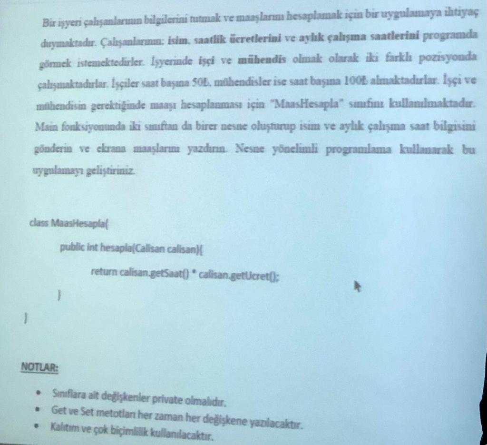

# Task



## Diyagram Çizelim

**Class Diagram (Sınıf Diyagramı):**

```
+---------------------+      +---------------------+      +---------------------+      +---------------------+
|      Calisan        |      |        Isci         |      |      Muhendis      |      |    MaasHesapla     |
|---------------------|      |---------------------|      |---------------------|      |---------------------|
| - saat: int         |      | + Isci()            |      | + Muhendis()        |      | + hesapla(Calisan)  |
| - ucret: int        |      +---------------------+      +---------------------+      +---------------------+
| - isim: String       |      | + Isci()            |      | + Muhendis()        |
|---------------------|      +---------------------+      +---------------------+
| + getIsim(): String |      |                     |      |                     |
| + getSaat(): int    |      |                     |      |                     |
| + getUcret(): int   |      |                     |      |                     |
| + setIsim(String)   |      |                     |      |                     |
| + setSaat(int)      |      |                     |      |                     |
| + setUcret(int)     |      |                     |      |                     |
+---------------------+      +---------------------+      +---------------------+
```

**Use Case Diagram (Kullanım Durumu Diyagramı):**

```
+---------------------+
|       Example       |
|---------------------|
| + main(String[])    |
+---------------------+
          |
          |
+---------------------+
|    MaasHesapla      |
|---------------------|
| + hesapla(Calisan)  |
+---------------------+
          |
          |
+---------------------+
|      Calisan        |
|---------------------|
| + getIsim(): String |
| + getSaat(): int    |
| + getUcret(): int   |
| + setIsim(String)   |
| + setSaat(int)      |
| + setUcret(int)     |
+---------------------+
          ^
         / \
+---------------------+
|        Isci         |
|---------------------|
| + Isci()            |
+---------------------+
          ^
         / \
+---------------------+
|      Muhendis       |
|---------------------|
| + Muhendis()        |
+---------------------+
```

Bu şablonlar, `Calisan` sınıfının temel özellikleri içerdiğini, `Isci` ve `Muhendis` sınıflarının bu temel sınıftan türediğini ve özel ücret ayarlamalarını içerdiğini gösterir. `MaasHesapla` sınıfı, `Calisan` tipinde nesneleri alarak `hesapla` metodunu içerir. `Example` sınıfı ise örnek nesneleri oluşturarak `MaasHesapla` sınıfını kullanır.

Kodlarınızın bu şablona uygun olduğunu görebilirsiniz.
