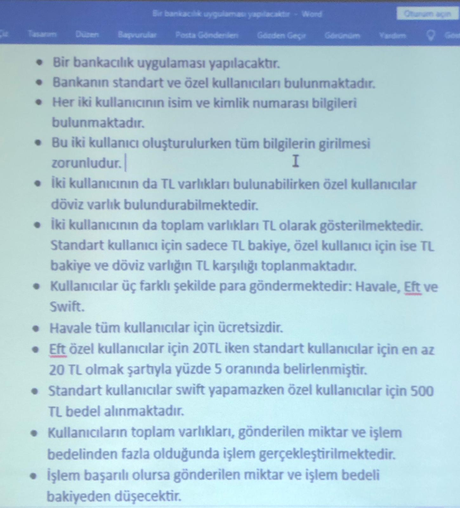

# Task



## Diyagram Çizelim

Tabii ki, metin tabanlı bir şablonda görsel diyagramların tam karşılığını sağlamak zor olabilir. Ancak, aşağıda temel bir şablon bulabilirsiniz:

**Use Case Diagram (Kullanım Durumu Diyagramı):**

```
+---------------------+        +-----------------------+
|       Kullanıcı     |        |      Transfer         |
|---------------------|        |-----------------------|
| + havaleYap()       |        | + havale()            |
| + eftYap()          |        | + eft()               |
|                     |        | + swift()             |
+---------------------+        +-----------------------+
```

**Class Diagram (Sınıf Diyagramı):**

```
+---------------------+        +-----------------------+
|      Kullanici      |        |      Transfer         |
|---------------------|        |-----------------------|
| - isim: String       |        | + havale(g: Kullanici,|
| - kimlik: String     |        |   a: Kullanici, m: double)|
| - tlBakiye: double   |        | + eft(g: Kullanici,   |
|---------------------|        |   a: Kullanici, m: double)|
| + getIsim(): String  |        | + swift(g: Ozel,      |
| + setIsim(String)    |        |   a: Ozel, m: double) |
| + getKimlik(): String|        +-----------------------|
| + setKimlik(String)  |
| + getTlBakiye(): double |
| + setTlBakiye(double)|
| + bakiyeGoster(m: double): double|
+---------------------+
          |
          |
          v
+----------------------+
|        Standart      |
|----------------------|
| + ORAN: int = 20      |
| + bakiyeGoster(m: double): double|
+----------------------+
          |
          |
          v
+----------------------+
|         Ozel         |
|----------------------|
| + TL_MALIYET: double = 20 |
| + DOVIZ_MALIYET: double = 500|
| - dovizBakiye: double |
| + getDovizBakiye(): double|
| + setDovizBakiye(double)|
| + bakiyeGoster(m: double): double|
+----------------------+
          |
          |
          v
+----------------------+
|        Doviz         |
|----------------------|
| + KUR: double = 20   |
+----------------------+
```

Bu şablon, kullanım durumu ve sınıf diyagramlarını temsil etmektedir. İlgili metot ve özellikleri içeren sınıflar arasındaki ilişkileri gösterir. Bu şablonu kullanarak kodlarınıza uygun detayları ekleyebilirsiniz.
