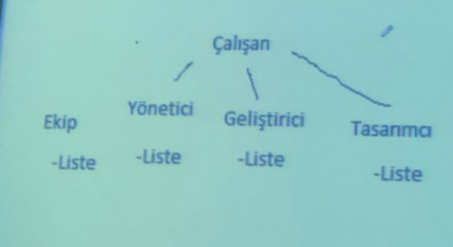
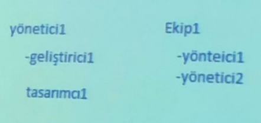

# Task

### `UML Diagram`

> 4 liste var hepsinde de birer liste + ekle + çıkar fonksiyonları var
> 4 liste : Calısan, Tasarımcı, Geliştirici, Yönetici

> liste yapısı hiyerarşiyi sağlıyor
> başta yönetici olmazsa yani Tasarımcı, Geliştirici olursa ne yaparız?
> Bunun için Ekip adlı yine içinde liste bulunduran bir yapın oluştururum. O da içindeki listede ekibi tutar
> SOLID 'deki open closed uyması için leaflerdeki listeleri tamamen sil
> Sadece ekip içinde liste olacak ve SOLID ilkelerine uyacak

> problem ne hiyerarşik yapıyı sağlamak + SOLID e uymak

