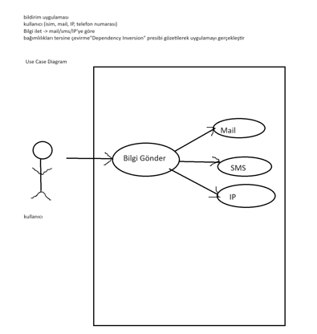

# Task


## `Use Case Diagram`



## `Diyagram Çizelim`

Use Case Diagram:

```
+----------------------+
|   Kullanici          |
+----------------------+
| - isim: String       |
| - mail: String       |
| - ip: String         |
| - telefon: String    |
+----------------------+
| + getIsim(): String  |
| + setIsim(String): void|
| + getMail(): String  |
| + setMail(String): void|
| + getIp(): String    |
| + setIp(String): void|
| + getTelefon(): String|
| + setTelefon(String): void|
+----------------------+
         |
         | uses
         |
         v
+----------------------+
|        Bilgi         |
+----------------------+
| - mesaj: String      |
+----------------------+
| + getMesaj(): String |
| + setMesaj(String): void|
+----------------------+
         |
         | uses
         |
         v
+----------------------+
|      Bildirim        |
+----------------------+
| # gonder(Kullanici, Bilgi): void|
+----------------------+
         /|\
          |
          | implements
          |
+----------------------+
|        Mail          |
+----------------------+
| + gonder(Kullanici, Bilgi): void|
+----------------------+
         /|\
          |
          | implements
          |
+----------------------+
|        Sms           |
+----------------------+
| + gonder(Kullanici, Bilgi): void|
+----------------------+
         /|\
          |
          | implements
          |
+----------------------+
|         Ip           |
+----------------------+
| + gonder(Kullanici, Bilgi): void|
+----------------------+
         |
         | extends
         |
+----------------------+
|    BildirimYonetim   |
+----------------------+
| - liste: ArrayList<Bildirim>|
+----------------------+
| + BildirimYonetim()  |
| + ekle(Bildirim): void|
| + getListe(): ArrayList<Bildirim>|
+----------------------+
         |
         | uses
         |
         v
+----------------------+
|   BildirimGonder     |
+----------------------+
| + bildirimGonder(Kullanici, Bilgi): void|
+----------------------+
```

Class Diagram:

```
+----------------------+
|   Kullanici          |
+----------------------+
| - isim: String       |
| - mail: String       |
| - ip: String         |
| - telefon: String    |
+----------------------+
| + getIsim(): String  |
| + setIsim(String): void|
| + getMail(): String  |
| + setMail(String): void|
| + getIp(): String    |
| + setIp(String): void|
| + getTelefon(): String|
| + setTelefon(String): void|
+----------------------+
         /|\
          |
          | uses
          |
         v
+----------------------+
|        Bilgi         |
+----------------------+
| - mesaj: String      |
+----------------------+
| + getMesaj(): String |
| + setMesaj(String): void|
+----------------------+
         |
         | uses
         |
         v
+----------------------+
|      Bildirim        |
+----------------------+
| # gonder(Kullanici, Bilgi): void|
+----------------------+
         /|\
          |
          | implements
          |
         v
+----------------------+
|        Mail          |
+----------------------+
| + gonder(Kullanici, Bilgi): void|
+----------------------+
         /|\
          |
          | implements
          |
         v
+----------------------+
|        Sms           |
+----------------------+
| + gonder(Kullanici, Bilgi): void|
+----------------------+
         /|\
          |
          | implements
          |
         v
+----------------------+
|         Ip           |
+----------------------+
| + gonder(Kullanici, Bilgi): void|
+----------------------+
         |
         | extends
         |
         v
+----------------------+
|    BildirimYonetim   |
+----------------------+
| - liste: ArrayList<Bildirim>|
+----------------------+
| + BildirimYonetim()  |
| + ekle(Bildirim): void|
| + getListe(): ArrayList<Bildirim>|
+----------------------+
         |
         | uses
         |
         v
+----------------------+
|   BildirimGonder     |
+----------------------+
| + bildirimGonder(Kullanici, Bilgi): void|
+----------------------+
```

These diagrams illustrate the structure and relationships between the classes in your Java code. The arrows indicate associations, and the "+" and "-" signs indicate public and private members, respectively.
