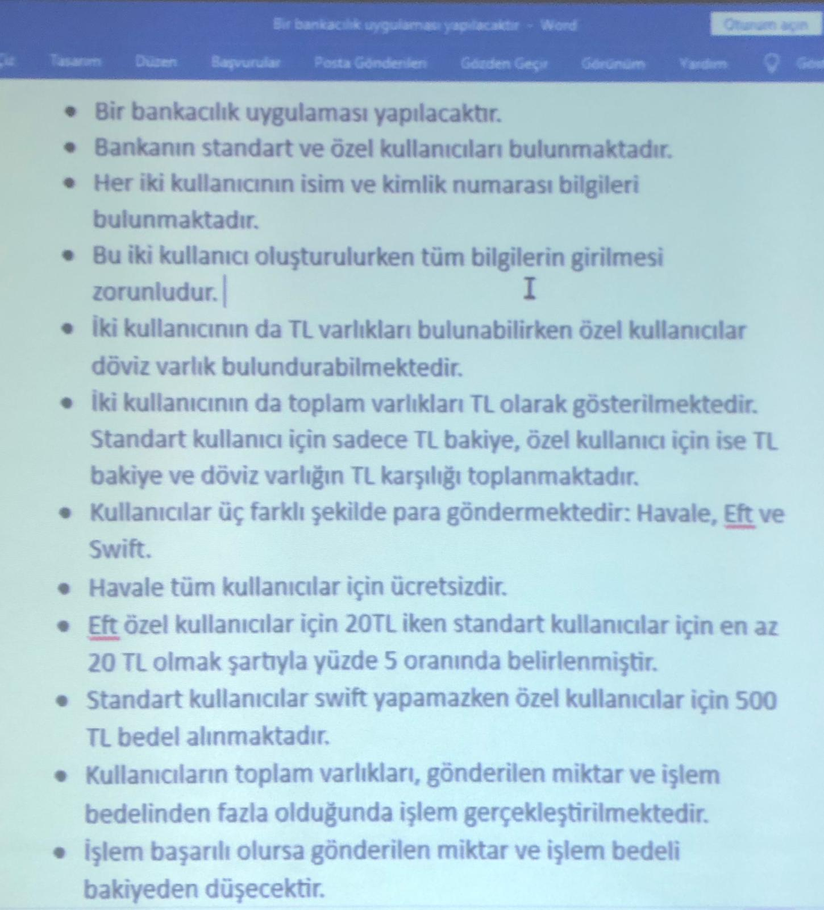

# Task

# Odev

> Kullanici classında tek sınıf altında yazılan Kullanıcı, Ozel, Standart classlarını 3 farklı sınıfa çevirelim

> [!IMPORTANT]
> Bu ödev classroom a yüklenmedi. Fakat [Lab4](https://github.com/elifbeyzatok00/yazilim-tasarim-desenleri-turkce-kaynak/tree/main/Labaratuvar-Dersleri/Lab4/Bankacilik-Uygulamasi/src)'te verilmişti.
