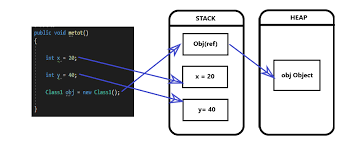
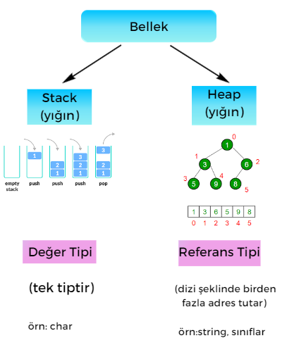
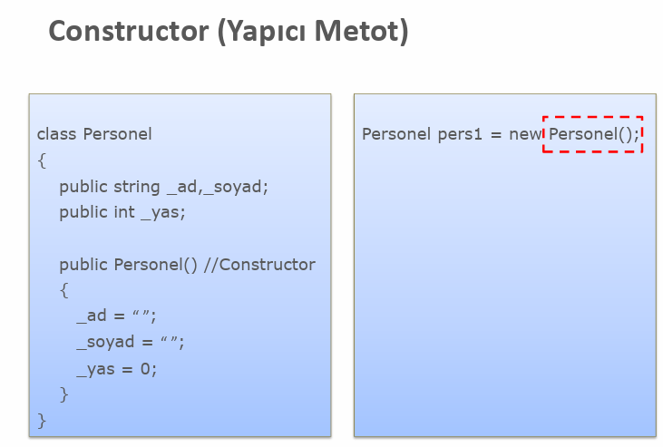
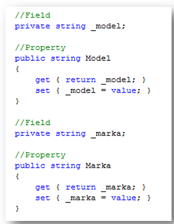
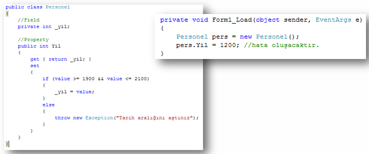
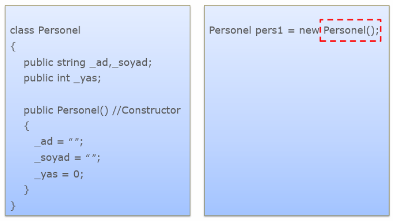

# yazilim-tasarim-desenleri-turkce-kaynak

## İçindekiler 📄
✨[Laboratuvar Kodları](https://github.com/elifbeyzatok00/yazilim-tasarim-desenleri-turkce-kaynak/tree/main/Labaratuvar-Dersleri)

1. [OOP Nedir?](#OOP)
2. [Nesne](#Nesne)
   - [Nesne Yönelimli Programlama İlkeleri](#Nesne-Yönelimli-Programlama-İlkeleri)
   - [Sınıf](#Sınıf)
        -[Encapsulation (Kapsülleme)](#Encapsulation (Kapsülleme))
        -[Inheritance (Kalıtım)](#Inheritance (Kalıtım))
        -[Polymorphism (Çok biçimlilik)](#Polymorphism (Çok biçimlilik))
        -[Abstraction (Soyutlama)](#Abstraction (Soyutlama))
4. [Sınıf](#Sınıf)
5. [Access modifiers](#Access-modifiers)
6. [UML’de ilişkilerin listesi](#UML’de-ilişkilerin-listesi-şu-şekilde:)
7. [İyi Bir Tasarım](#İyi-Bir-Tasarım)
   1. [Esnemezlik (Rijidite)](#1.-Esnemezlik (Rijidite))
   2. [Kırılganlık (Fragility)](#Kırılganlık (Fragility))
8. [S.O.L.I.D. Nedir?](#solid-nedir)
   - [Single Responsibility (Tek Sorumluluk Prensibi)](#single-responsibility-principle-tek-sorumluluk-prensibi)
   - [Open/Closed Principle (Açık Kapalı Prensibi)](#openclosed-principle-açık-kapalı-prensibi)
   - [Liskov Substitution (Liskov’un Yerine geçme Prensibi)](#liskov-substitution-principle-liskovun-yerine-geçme-prensibi)
   - [Interface Segregation (Arayüz Ayrımı Prensibi)](#interface-segregation-principle-arayüz-ayrımı-prensibi)
   - [Dependency Inversion (Bağımlılıkların Tersine Çevrilmesi Prensibi)](#dependency-inversion-principle-bağımlılıkların-tersine-çevrilmesi-prensibi)
9. [Tasarım Deseni Nedir?](#tasarım-deseni-nedir)
10. [Tasarım Desenleri](#tasarım-desenleri)
   - [Creational  (Oluşturucu)](#creational-oluşturucu)
     - [Singleton](#-singleton)
     - [Factory](#-factory)
     - [Abstract Factory](#-abstract-factory)
     - [Builder](#%EF%B8%8F-builder)
     - [Prototype](#-prototype)
   - [Structural (Yapısal)](#structural-yapısal)
     - [Adapter](#-adapter)
     - [Bridge](#-bridge)
     - [Composite](#-composite)
     - [Decorator](#-decorator)
     - [Facade](#-facade)
     - [Flyweight](#%EF%B8%8F-flyweight)
     - [Proxy](#-proxy)
   - [Behavioral (Davranışsal)](#behavioral-davranışsal)
     - [Chain of Responsibility](#%EF%B8%8F-chain-of-responsibility)
     - [Command](#-command)
     - [Interpreter](#%EF%B8%8F-interpreter)
     - [Iterator](#%EF%B8%8F-iterator)
     - [Mediator](#-mediator)
     - [Memento](#%EF%B8%8F-memento)
     - [Observer](#-observer)
     - [State](#-state)
     - [Strategy](#-strategy)
     - [Template Method](#-template-method)
     - [Visitor](#%EF%B8%8F-visitor)
11. [Kapanış](#kapan%C4%B1%C5%9F)
12. [Kaynakçalar](#kaynakçalar)

## OOP

### Nedir?

Nesne yönelimli programlama paradigması, gerçek hayatta olan varlıkları yazılım dünyasında modellemekte kullandığımız, her işlevin nesneler olarak soyutlandığı bir programlama yaklaşımıdır. Tıpkı gerçek hayatta olduğu gibi yazılımda da bu sayede nesnelerimizin öznitelikleri, davranışları olacaktır.
Ortaya çıkış nedenlerinden bazıları da yazılımda; karmaşıklığı azaltmaya, bakım maliyetini düşürmeye, modülariteyi artırmaya, nesneler arası hiyerarşiyi kurmaya yaramasıdır.

## Nesne

### Nedir?


Yukarıda Developer adında bir sınıf görülmektedir. Sınıf alanlar (fields) ve davranışlarımızın (methods) tanımlandığı yerdir. Nesne ise bu sınıftan bir örnek alınmış halidir.

### Nesne Yönelimli Programlama İlkeleri

Nesne yönelimli programlama 4 temel ilke üzerine kuruludur ve bir dilin, nesne yönelimli programlamayı uyguluyor denebilmesi için 4 koşulu da sağlıyor olması gerekiyor. Bunlar; Encapsulation, Abstraction, Inheritance, Polymorphism


## Sınıf

### Nedir?

Yukarıdaki örnekte bir adet sınıf kullanıldı ama gerçek uygulamalarda bildiğimiz gibi bir sınıftan daha fazlası mevcut. Bunlar arasında bir hiyerarşi, düzen mevcut. Tıpkı gerçek hayatta olduğu gibi.
Hiyerarşi düzeninde; genel, kapsayıcı sınıfa superclass (üst sınıf). Bunlardan türeyen sınıflara da subclasses (alt sınıflar) denir. Bu hiyerarşi ile birlikte alt sınıflar, üst sınıfların özelliklerini ve davranışlarını almaktadır.

Örnek Kod C#

```cs
using System;

class Ogrenci
{
public string Adi;
public int Yas;

    public void BilgileriGoster()
    {
        Console.WriteLine("Adı: " + Adi);
        Console.WriteLine("Yaşı: " + Yas);
    }

}

class Program
{
static void Main()
{
Ogrenci ogrenci = new Ogrenci();
ogrenci.Adi = "Ahmet";
ogrenci.Yas = 20;

        ogrenci.BilgileriGoster();

        Console.ReadLine();
    }

}
```

Örnek Kod Java

```java
class Ogrenci {
    String adi;
    int yas;

    void bilgileriGoster() {
        System.out.println("Adı: " + adi);
        System.out.println("Yaşı: " + yas);
    }
}

public class Main {
    public static void main(String[] args) {
        Ogrenci ogrenci = new Ogrenci();
        ogrenci.adi = "Ahmet";
        ogrenci.yas = 20;

        ogrenci.bilgileriGoster();
    }
}

```

Örnek Kod Python

```python
class Ogrenci:
    def __init__(self, adi, yas):
        self.adi = adi
        self.yas = yas

    def bilgileri_goster(self):
        print("Adı:", self.adi)
        print("Yaşı:", self.yas)

ogrenci = Ogrenci("Ahmet", 20)
ogrenci.bilgileri_goster()

```

Bu örneklerde, "Ogrenci" adında bir sınıf oluşturuldu. Bu sınıf içinde "Adi" ve "Yas" adında iki özellik (property) bulunuyor. C# ve Java örneklerinde bu özelliklere doğrudan erişim sağlanabiliyor. Python örneğinde ise "init" metodunu kullanarak sınıfın yapıcı metodunu tanımlayıp, özelliklere erişim sağlanıyor. Ayrıca, her üç dilde de "bilgileriGoster" veya "bilgileri_goster" adında bir metod ile sınıfın özelliklerini ekrana yazdırmak için bir fonksiyon oluşturuldu.

## Encapsulation (Kapsülleme)

### Nedir?

Gereksiz detayların kullanıcıdan gizlenmesidir.

Herhangi bir nesnenin metotlarını, verilerini veya değişkenlerini diğer nesnelerden saklayarak ve bunlara erişimini sınırlandırarak yanlış kullanımlardan koruyan bir konsepttir. Bir nesne üzerinde hem veri soyutlama hem de kontrol soyutlaması yapılıyor ise buna sarma adı verilir. Çoğu programlama dilleri kapsüllemeyi aşağıda sıraladığımız erişim belirteçleri ile desteklerler.

public: Erişimin her yerden yapılabileceği anlamı taşıyor.

private: Erişimin tanımlandığı sınıf içerisinden yapılabileceği anlamı taşıyor.

protected: Sadece tanımlandığı sınıfın içinden veya o sınıftan türetilmiş diğer sınıfların içinden erişilebilir.

Örnek Kod C#

```cs
using System;

class Kisi
{
    private string ad;
    private int yas;

    public void SetAd(string yeniAd)
    {
        ad = yeniAd;
    }

    public string GetAd()
    {
        return ad;
    }

    public void SetYas(int yeniYas)
    {
        if (yeniYas >= 0)
        {
            yas = yeniYas;
        }
        else
        {
            Console.WriteLine("Hatalı yaş değeri.");
        }
    }

    public int GetYas()
    {
        return yas;
    }
}

class Program
{
    static void Main(string[] args)
    {
        Kisi kisi = new Kisi();
        kisi.SetAd("Ahmet");
        kisi.SetYas(30);

        Console.WriteLine("Ad: " + kisi.GetAd());
        Console.WriteLine("Yaş: " + kisi.GetYas());
    }
}

```

Örnek Kod Java

```java
public class Kisi {
    private String ad;
    private int yas;

    public void setAd(String yeniAd) {
        ad = yeniAd;
    }

    public String getAd() {
        return ad;
    }

    public void setYas(int yeniYas) {
        if (yeniYas >= 0) {
            yas = yeniYas;
        } else {
            System.out.println("Hatalı yaş değeri.");
        }
    }

    public int getYas() {
        return yas;
    }
}

public class Main {
    public static void main(String[] args) {
        Kisi kisi = new Kisi();
        kisi.setAd("Ayşe");
        kisi.setYas(25);

        System.out.println("Ad: " + kisi.getAd());
        System.out.println("Yaş: " + kisi.getYas());
    }
}

```

Örnek Kod Python

```python
class Kisi:
    def __init__(self):
        self.__ad = ""
        self.__yas = 0

    def set_ad(self, yeni_ad):
        self.__ad = yeni_ad

    def get_ad(self):
        return self.__ad

    def set_yas(self, yeni_yas):
        if yeni_yas >= 0:
            self.__yas = yeni_yas
        else:
            print("Hatalı yaş değeri.")

    def get_yas(self):
        return self.__yas

kisi = Kisi()
kisi.set_ad("Mehmet")
kisi.set_yas(35)

print("Ad: " + kisi.get_ad())
print("Yaş: " + str(kisi.get_yas()))

```

Bu örneklerde, Kisi sınıfı içinde ad ve yas adında private (private C#, Java; private ve başına çift alt çizgi eklenerek private yapılır - Python) değişkenler kullanılarak encapsulation uygulanmıştır. Bu değişkenlere erişim için set ve get metotları kullanılmıştır. Bu şekilde, değişkenlere doğrudan erişim yerine metodlar aracılığıyla erişim sağlanmış olur ve veri gizliliği ve güvenliği artırılmış olur.

## Inheritance (Kalıtım)

### Nedir?

Bir sınıftan başka sınıfların türetilmesidir.

Kalıtım, mevcut sınıfların üzerine yeni sınıflar oluşturma yeteneğidir. Bu sayede türetilen sınıf, türediği sınıfın özelliklerini devralır. Kalıtımın en büyük yararı kodun yeniden kullanılmasıdır. Mevcut sınıftan biraz farklı bir sınıf oluşturmak istiyorsak, kodu kopyalamamıza gerek yoktur. Bunun yerine, varolan sınıfı genişletir ve ekstra işlevselliği alt sınıfa koyarız.  


Çoğu programlama dilinde yalnızca bir sınıftan türetme işlemi gerçekleştirilmektedir ama birden fazla interface'den (ara birimden) türetilme işlemi de gerçekleştirilebilmektedir.

Örnek Kod C#

```cs
using System;

class Person
{
    protected string ad;
    protected int yas;

    public void BilgileriGoster()
    {
        Console.WriteLine("Ad: " + ad);
        Console.WriteLine("Yaş: " + yas);
    }
}

class Ogrenci : Person
{
    private int ogrenciNo;

    public Ogrenci(string ad, int yas, int ogrenciNo)
    {
        this.ad = ad;
        this.yas = yas;
        this.ogrenciNo = ogrenciNo;
    }

    public void OgrenciBilgileriGoster()
    {
        BilgileriGoster();
        Console.WriteLine("Öğrenci No: " + ogrenciNo);
    }
}

class Program
{
    static void Main(string[] args)
    {
        Ogrenci ogrenci = new Ogrenci("Ayşe", 20, 12345);
        ogrenci.OgrenciBilgileriGoster();
    }
}

```

Örnek Kod Java

```java
class Person {
    protected String ad;
    protected int yas;

    public void bilgileriGoster() {
        System.out.println("Ad: " + ad);
        System.out.println("Yaş: " + yas);
    }
}

class Ogrenci extends Person {
    private int ogrenciNo;

    public Ogrenci(String ad, int yas, int ogrenciNo) {
        this.ad = ad;
        this.yas = yas;
        this.ogrenciNo = ogrenciNo;
    }

    public void ogrenciBilgileriGoster() {
        bilgileriGoster();
        System.out.println("Öğrenci No: " + ogrenciNo);
    }
}

public class Main {
    public static void main(String[] args) {
        Ogrenci ogrenci = new Ogrenci("Mehmet", 22, 67890);
        ogrenci.ogrenciBilgileriGoster();
    }
}

```

Örnek Kod Python

```python
class Person:
    def __init__(self, ad, yas):
        self.ad = ad
        self.yas = yas

    def bilgileri_goster(self):
        print("Ad:", self.ad)
        print("Yaş:", self.yas)

class Ogrenci(Person):
    def __init__(self, ad, yas, ogrenci_no):
        super().__init__(ad, yas)
        self.ogrenci_no = ogrenci_no

    def ogrenci_bilgileri_goster(self):
        self.bilgileri_goster()
        print("Öğrenci No:", self.ogrenci_no)

ogrenci = Ogrenci("Ali", 21, 54321)
ogrenci.ogrenci_bilgileri_goster()

```

Bu örneklerde, Person sınıfı bir kişinin adını ve yaşını temsil ederken, Ogrenci sınıfı Person sınıfından kalıtım alarak öğrenci numarasını ekler. Böylece Ogrenci sınıfı, Person sınıfının özelliklerini ve metotlarını miras alır ve aynı zamanda kendi özel özelliklerini (öğrenci numarası) ve metotlarını da ekleyebilir. Bu, kalıtımın temel mantığıdır.

## Polymorphism (Çok biçimlilik)

### Nedir?

- Nesnelerin türüne bakılmaksızın koşturulmasıdır.
- Robot koş, kuş koş, at koş gibi

Bir nesnenin başka bir nesne gibi davranabilmesi, kullanılabilmesi. Biraz daha açık bir ifade ile: alt sınıfların, üst sınıflara ait olan davranışlarını başka bir biçimde gerçekleştiriyor olması olayıdır.


Nesnenin davranışı çalışma anında belirlendiği için, çok biçimlilik özelliği sayesinde nesnelerin türünü önceden bilmek zorunda kalmayız.

Örnek Kod C#

```cs
using System;

class Sekil
{
    public virtual void Ciz()
    {
        Console.WriteLine("Bir şekil çizildi.");
    }
}

class Dikdortgen : Sekil
{
    public override void Ciz()
    {
        Console.WriteLine("Dikdörtgen çizildi.");
    }
}

class Ucgen : Sekil
{
    public override void Ciz()
    {
        Console.WriteLine("Üçgen çizildi.");
    }
}

class Program
{
    static void Main(string[] args)
    {
        Sekil sekil = new Sekil();
        sekil.Ciz();

        Sekil dikdortgen = new Dikdortgen();
        dikdortgen.Ciz();

        Sekil ucgen = new Ucgen();
        ucgen.Ciz();
    }
}

```

Örnek Kod Java

```java
class Sekil {
    public void ciz() {
        System.out.println("Bir şekil çizildi.");
    }
}

class Dikdortgen extends Sekil {
    public void ciz() {
        System.out.println("Dikdörtgen çizildi.");
    }
}

class Ucgen extends Sekil {
    public void ciz() {
        System.out.println("Üçgen çizildi.");
    }
}

public class Main {
    public static void main(String[] args) {
        Sekil sekil = new Sekil();
        sekil.ciz();

        Sekil dikdortgen = new Dikdortgen();
        dikdortgen.ciz();

        Sekil ucgen = new Ucgen();
        ucgen.ciz();
    }
}

```

Örnek Kod Python

```python
class Sekil:
    def ciz(self):
        print("Bir şekil çizildi.")

class Dikdortgen(Sekil):
    def ciz(self):
        print("Dikdörtgen çizildi.")

class Ucgen(Sekil):
    def ciz(self):
        print("Üçgen çizildi.")

sekil = Sekil()
sekil.ciz()

dikdortgen = Dikdortgen()
dikdortgen.ciz()

ucgen = Ucgen()
ucgen.ciz()

```

Bu örneklerde, Sekil sınıfı bir şekli temsil ederken, Dikdortgen ve Ucgen sınıfları Sekil sınıfından kalıtım alarak kendi ciz metotlarını (metod override) uygularlar. Bu durumda, Sekil türündeki bir nesneyle Dikdortgen veya Ucgen nesnesi aynı metodu çağırabilir ve farklı davranışlar sergileyebilir. Bu, polimorfizmin temel özelliğidir.

## Abstraction (Soyutlama)

### Nedir?

- Ortak özellikteki nesnelerin aynı çatıda toplanmasıdır.
- **Interface** ve **abstract class**'lar aracılığıyla sağlanır.

Farklı kod parçalarının kompleks kısımlarını, sahip oldukları ortak davranışlar, amaçlar, karakteristik özellikler arkasında saklamak sayesinde daha anlaşılır ve kolay kullanılabilir kod yazmaktır abstraction.
Örnek Kod C#

```cs
using System;

abstract class Sekil
{
    public abstract void Ciz();
}

class Dikdortgen : Sekil
{
    public override void Ciz()
    {
        Console.WriteLine("Dikdörtgen çizildi.");
    }
}

class Ucgen : Sekil
{
    public override void Ciz()
    {
        Console.WriteLine("Üçgen çizildi.");
    }
}

class Program
{
    static void Main(string[] args)
    {
        Sekil dikdortgen = new Dikdortgen();
        dikdortgen.Ciz();

        Sekil ucgen = new Ucgen();
        ucgen.Ciz();
    }
}

```

Örnek Kod Java

```java
abstract class Sekil {
    public abstract void ciz();
}

class Dikdortgen extends Sekil {
    public void ciz() {
        System.out.println("Dikdörtgen çizildi.");
    }
}

class Ucgen extends Sekil {
    public void ciz() {
        System.out.println("Üçgen çizildi.");
    }
}

public class Main {
    public static void main(String[] args) {
        Sekil dikdortgen = new Dikdortgen();
        dikdortgen.ciz();

        Sekil ucgen = new Ucgen();
        ucgen.ciz();
    }
}

```

Örnek Kod Python

```python
from abc import ABC, abstractmethod

class Sekil(ABC):
    @abstractmethod
    def ciz(self):
        pass

class Dikdortgen(Sekil):
    def ciz(self):
        print("Dikdörtgen çizildi.")

class Ucgen(Sekil):
    def ciz(self):
        print("Üçgen çizildi.")

dikdortgen = Dikdortgen()
dikdortgen.ciz()

ucgen = Ucgen()
ucgen.ciz()

```

Bu örneklerde, Sekil soyut sınıf (abstract class) olarak tanımlanmıştır. Soyut sınıflar soyut metotlar (abstract methods) içerebilir. Soyut metotlar sadece imza (signature) olarak tanımlanır, yani metotun gövdesi soyut sınıf içinde yer almaz. Soyut metotları olan bir sınıf, bu metotları miras alan alt sınıflar tarafından zorunlu olarak implemente edilmelidir. Bu, soyutlamayı (abstraction) sağlayan bir özelliktir.

## Access modifiers

Public → +
Private → -
Protected → #
package/default -> ~

Sınıf gösterimini gördük. Ancak sınıfın tek başına gösterimi bir şey ifade etmiyor. Bu sınıflar arasındaki bağlantıların gösterimi de önemli.

### UML’de ilişkilerin listesi şu şekilde:

1- Generalization/Inheritance

2- Realization/Implementation

3- Association

4- Dependency (Aggregation & Composition)

#### 1- Generalization/Inheritance


Üstte kalıtımın nasıl ifade edildiğinin gösterimi bulunmakta. Bu gösterim abstract sınıftan kalıtım alırken de aynı. Bu tür kalıtım ilişkisinde **nesneler arasında “IS-A” ilişkisi** bulunmaktadır.

```
“Tortoise IS AN Animal”

“Kaplumbağa bir hayvandır.”
```

#### 2- Realization/Implementation

Bu ilişki **arayüzler ile sınıflar arasındaki ilişki**yi modellemek için kullanılır. Dashed(kesikli) çizgi ile ifade edilir. Kalıtımdaki çizginin kesik kesik olan halidir.


#### 3- Association

Burada da **sınıflar arasında HAS-A ilişkisi** bulunuyor.

##### Associationlar 4 çeşide ayrılmaktadır:

- bi-directional(tek yönlü),
- uni-directional(çift yönlü),
- reflexive
- aggregation & composition

###### Bi-directional Association

Bu iki sınıf arasında tek taraflı bir ilişki olduğunda
kullanılmakta.

Üstteki ilişkinin okunuşu şu şekildedir.

```
“Person HAS AN Address”

“İnsan bir adrese sahiptir”
```

Burada 1 yerine 0..n şeklinde bir ifade de kullanılabilirdi. Üstteki ilişkide 1 yazdığı için, Person sınıfı içerisinde Address sınıfı tipinde bir attribute bulunacağını belirtiyor. Ancak Address sınıfında Person ile ilgili bir bilgi yer almıyor. Çünkü ilişki türü bi-directional(tek yönlü). Ayrıca ilişki ile ilgili aradaki bağlantıya isim verebilmemiz mümkün. Bu tercihe bağlı bırakılmıştır.

###### Uni-directional Association

Bu iki sınıf arasında çift taraflı bir ilişki olduğunda kullanılmakta.


Üstte bunun çok güzel bir örneği bulunmakta. Bu ifadenin Türkçe’si şu şekilde. Student sıfır ya da sonsuz tane kursa kayıt olmuş olabilir, aynı şekilde kursa hiç öğrenci kayıt olmamış olabilir ya da sonsuz tane öğrenci kayıt olabilir. Burada sol tarafta bulunan sınıfı karşı ilişkili olduğu sınıf tarafındaki sayı ilgilendiriyor. Sağdakini de tam tersi. Yani bir kursa en az 1 öğrenci kayıt olmalı ifadesi için Student sınıfı tarafını 1..\* şeklinde değiştirecektik. Student sınıfında Course sınıfından yaratılmış nesnelerin listesi, Course sınıfında da Student sınıfından yaratılmış nesnelerin listesi tutulmakta.

###### Reflexive

Anlaması en zor ilişki bu diyebiliriz. Reflexive(dönüşlü) yani sınıfın kendisi ile yaptığı ilişkidir.


Üstte reflexive ilişki için güzel bir örnek yer alıyor. Directory(Dosya dizini) hiç ya da sonsuz sayıda alt dosya dizinine sahip olabilir. Aynı şekilde hiç ya da 1 tane üst dizine sahip olabilir. Directory sınıfı kendi sınıfından türettiği 2 tane directory nesnesi ile üstteki modeli gerçekleştirebilir.

###### Dependency (Aggregation & Composition)

Bu ilişki türünü çift yönlü association olarak düşünebiliriz. Ancak ekstra sınıflar arasında bağlılıktan söz edeceğiz.

Aggregation ve Composition’da sınıflar arasında parçası olma anlamı vardır. Bir sınıf diğer sınıfın bir parçasıdır. Bu ilişki Aggregation’da biraz daha zayıfken, Composition’da daha güçlüdür. Çünkü Composition ilişkisinde parçası olduğu sınıf yok olursa diğer sınıfta yok olmaktadır. Bu tür ilişkilerde HAS-A ya da IS-PART-OF şeklinde okuyabiliriz.

###### Aggregations (İçerme) İlişkisi

- Sahiptir veya içerir ilişkisini gösterir.
- İçinin boş olması, ilişki olmadan da nesnenin var olabileceğini gösterir.
  

Aşağıda sınıflar arasında Aggregation ilişkisini görebilirsiniz. Tekerlek araba sınıfının bir parçasıdır. Ancak araba sınıfı yok olduğunda tekerlek yok olmak zorunda değildir. Aralarında zayıf bir parça ilişkisi vardır.


###### Composition (Bağımlı İyelik) İlişkisi

- Parçalar olmadan nesne hiçbir anlam ifade etmez.
  

Aşağıda sınıflar arasında Composition ilişkisini görebilirsiniz. Kalp, insan sınıfının bir parçasıdır. İnsan sınıfı yok olduğunda kalpte yok olacaktır. İki sınıf arasında güçlü bir parça ilişkisi vardır. Composition ile agreegation arasındaki fark budur.


### İyi Bir Tasarım

#### 1. Esnemezlik (Rijidite)

- Eğer sistem değişime aşırı derecede direnç gösteriyorsa rijit bir sistemdir.
- İyi bir tasarımda direnç düşük olmalıdır.

#### 2. Kırılganlık (Fragility)

- Daha az kırılgan sistemler geliştirilmelidir.

#### 3. İmmabilite

- Yazılım sistemleri modüler şekilde tasarlanmalıdır.
- Bir projenin modülünün başka bir projede de kullanılmasına **reusability** denir.

## Çevik(Agile) Yazılım Geliştirme Süreci

Agile bir proje yönetim metodolojisi olarak tanımlanabilir. Farklı disiplinlerde farklı framework'ler İle kullanılır.
İlk kullanılmaya başlandığı alan yazılım olduğu İçin yazılım geliştirme metodolojisi olarak da anılmaktadır.

Bu konu ile ilgili sunumu incelemek için [buraya](https://www.canva.com/design/DAFw1kSJ3vk/fTo0fvSROhmkWpz_Gs1cuQ/edit?utm_content=DAFw1kSJ3vk&utm_campaign=designshare&utm_medium=link2&utm_source=sharebutton) tıklayınız.

### Çevik Modelde Yazılım Yaşam Dönüsünü Sağlamak İçin Hangi Araçlar Kullanılıyor?

Çevik modelde yazılım yaşam döngüsünü yönetmek için birçok araç ve platform bulunmaktadır. Bunlar, işbirliğini artırmak, görevleri takip etmek, süreçleri yönetmek, geri bildirimleri almak ve proje sürecini izlemek için kullanılır.

1. Trello: Trello, görevleri kartlar şeklinde düzenlemeye ve taşımaya dayalı bir proje yönetim aracıdır. Takım üyeleri, görevleri ve projeyi kartlarla organize edebilirler.

2. Asana: Asana, projeleri ve görevleri planlamak, organize etmek ve izlemek için kullanılan bir platformdur. Görevleri takip etmek, önceliklendirmek ve süreci görselleştirmek için kullanışlıdır.

3. VersionOne: VersionOne, çevik yazılım geliştirme süreçlerini yönetmek için kullanılan bir platformdur. Backlog yönetimi, planlama, takım işbirliği ve raporlama gibi özelliklere sahiptir.

4. Targetprocess: Targetprocess, çeşitli ölçeklerdeki projeleri yönetmek için kullanılan bir çevik yönetim aracıdır. Scrum, Kanban, XP ve diğer çevik süreçleri destekler.

5. Clubhouse: Clubhouse, yazılım geliştirme süreçlerini yönetmek için kullanılan basit ve esnek bir araçtır. Görevleri, epikleri ve kullanıcı hikayelerini izlemek için kullanılır.

6. Pivotal Tracker: Pivotal Tracker, çevik yazılım geliştirme süreçlerini yönetmek için kullanılan bir platformdur. Proje özelliklerini, hikayeleri ve görevleri izlemek için kullanılır.

7. Basecamp: Basecamp, proje yönetimi ve işbirliği için kullanılan bir platformdur. Proje görevlerini, dosyaları ve takvimleri yönetmek için kullanılır.

8. Monday.com: Monday.com, takımların işlerini planlamak, izlemek ve yönetmek için kullanılan bir işbirliği platformudur. Özelleştirilebilir panolar ve otomatik bildirimler gibi özelliklere sahiptir.

Bu araçlar, çevik ekiplerin projelerini daha etkili bir şekilde yönetmelerine yardımcı olabilir. Hangi aracın kullanılacağı, projenin özel gereksinimlerine, takımın tercihlerine ve bütçeye bağlı olarak değişebilir.

## Değer Tipi, Referans Tipi, Steak, Heap Nedir/Nasıl Çalışır?

Değer tipi (value type) ve referans tipi (reference type), programlama dillerinde veri türlerini temsil eden iki önemli kavramdır. Bu terimler, bir programın bellek yönetimi ve veri depolama şekli ile ilgilidir. Ayrıca, "stack" ve "heap" terimleri, bellek yönetimiyle ilişkilendirilen iki farklı bellek bölgesini temsil eder.

### Değer Tipi (Value Type)

Değer tipi, değerleri doğrudan içerir ve bellekte değerlerin kendileri saklanır. Değer tipleri, genellikle temel veri tipleri olarak adlandırılır ve bellekte sabit bir boyutta yer kaplarlar. Örnek olarak, **int, float, char** gibi veri tipleri değer tiplerine örnek olarak verilebilir. Değer tipleri doğrudan bellek üzerinde saklandığı için hızlıdır ve bellek yönetimi daha basittir.

```java
int sayi = 42; // Değer tipi örnek: sayi değişkeni değeri doğrudan bellekte saklanır.
```

### Referans Tipi(Reference Type):

Referans tipleri, değerlerin bellekte bir referans aracılığıyla saklandığı nesneleri temsil eder. Yani, bellekte değerlerin kendisi değil, değerlerin bulunduğu bellek adresi (referans) saklanır. Referans tipleri, genellikle **sınıflar, diziler ve diğer nesne tabanlı yapılar** gibi karmaşık veri tipleri olarak kullanılır. Bu tür veri tipleri, bellek yönetimi için daha fazla karmaşıklık gerektirir, çünkü nesneler dinamik olarak bellekte oluşturulabilir ve yönetilebilir.

```java
List<int> sayiListesi = new List<int>(); // Referans tipi örnek: sayiListesi bir referansı saklar ve bellekte dinamik olarak oluşturulur.

```

### Stack:

Stack bellek bölgesi, genellikle değer tipleri ve referanslar için kullanılan bir bellek bölgesidir. **Değer tipleri doğrudan stack bellek bölgesinde saklanır.** Ayrıca, referanslar (nesnelerin bellek adresleri) de stack bellek bölgesinde saklanabilir. Stack bellek bölgesi hızlı erişime izin verir ve bellek yönetimi otomatik olarak gerçekleşir. Ancak, stack bellek bölgesi sabit bir boyuta sahiptir ve genellikle kısıtlı bir büyüklüğe sahiptir.

### Heap:

Heap bellek bölgesi, genellikle **referans tipleri için dinamik bellek tahsisi için kullanılır.** Yani, heap bellek bölgesi, program çalıştığı sürece değişebilen dinamik veri yapılarını (örneğin, değişken boyutlu diziler ve nesneler) saklamak için kullanılır. Heap bellek bölgesi, programcının manuel olarak bellek tahsisi ve geri verme işlemlerinden sorumlu olduğu daha esnek bir bellek alanıdır. Bu, daha fazla bellek kullanım esnekliği sağlar, ancak doğru yönetilmezse bellek sızıntılarına (memory leaks) yol açabilir.




int, short, long, byte, float, double, decimal, char, bool => değer tipi
string, diziler, class, interface, enum, struct => referans tipi

###### null referans tip midir?

Evet, "null" bir referans değeridir.

```
null -> object => referans tip
```

Programlamada, "null" terimi, bir değişkenin değerinin atanmamış veya geçersiz olduğunu ifade eder. Yani, bir değişkenin "null" değeri, bellekte hiçbir nesneyi veya veriyi temsil etmediğini gösterir.

## S.O.L.I.D.

### Nedir?

S.O.L.I.D., yazılım geliştirirken sürdürülebilir kod yazmamızı sağlayan bir prensipler bütünüdür.

Buradaki sürdürülebilirlikten kasıt; yazılım gereksinimleri değiştiğinde ya da mevcut yazılıma eklemeler yapıldığında sistemin buna direnç göstermemesi, en azından en az direnci göstermesi, yani esnek olmasıdır. Bunların yanı sıra bakımının ve anlaşılmasının kolay olması gibi nedenler de sayılabilir.

Bunları yapmamızı sağlayan prensipleri 5 madde içerisinde inceleyeceğiz.

> **S → SRP (Single Responsibility Principle)(Tek Sorumluluk Prensibi)**
> Her birimin tek bir sorumluluğu olmalıdır.

> **O → OCP (Open Closed Principle)(Açık Kapalı Prensibi)**
> Geliştirilmeye açık, değişikliğe kapalı olmalıdır.

> **L → LSP (Liskov's Substition Principle)(Likov'un Yerine Geçme Prensibi)**
> Alt sınıf, üst sınıfın yerine geçtiğinde aynı davranışı göstermelidir.

> **I → ISP (Interface Segregation Principle)(Arayüz Ayrımı Prensibi)**
> Belirli işlemleri yapan interface'ler oluşturulmalıdır.

> **D → DIP (Dependency Inversion Principle)(Bağımlılıkların Tersine Çevrilmesi Prensibi)**
> Bağımlılıklar soyut sınıflara doğru olmalıdır

Bu prensipleri daha detaylı inceleyelim:

#### S → SRP (Single Responsibility Principle)(Tek Sorumluluk Prensibi)

Her sınıf, metot, fonksiyon tek bir sorumluluğa sahip olmalıdır.
Tek bir sorumluluk yerine getirmek üzere tasarlanmıştır

Şayet bu kurala uymazsak ilerleyen süreçte bir değişikliğe gidildiğinde bunun etkisini birçok yerde görmüş oluruz. Nedeni ise bir yapıya birden fazla sorumluluk yüklenmesinden dolayıdır. Eğer değişikliklerden etkilenen yerler arasında sistemin birçok yerinde kullanılan bir yapımız da varsa maliyet gittikçe artacaktır.

Örnek Kod Java

```java
public class BasvuruIslemleri {
    public string Cek {get; set;}
    public string Fatura {get; set;}
    public double Senet {get; set;}
    public void CekIslem(string CekBilgileri){
    ...
    }
    public void FaturaBas(){
    ...
    }
    public bool SenetKontrol(){
    ...
    }
}
```

Kod yazımı SRP'ye **uygun değildir**.Bunun yerine aşağıdaki gibi yazılmalıdır.

```java
 public class BasvuruIslemleri{
...
}
public class Cek{
...
}
public class Fatura{
...
}
public class Senet{
...
}
```

#### O → OCP (Open Closed Principle)(Açık Kapalı Prensibi)

- Esnek tasarımlar yapılmalıdır
- Yapılarımız (sınıf, metot, fonksiyon) gelişime açık, değişime kapalı olmalıdır.
- Değişim **sadece yeni kodlar eklenerek** olmalıdır

Yazılımlar için zamanla değişim şüphesiz kaçınılmazdır; değişen iş kuralları, kullanılan harici kütüphaneler gibi başlıca nedenler örnek gösterilebilir. Bu prensibin anlatmak istediği şey yeni bir davranış ya da özellik eklemek istediğimiz durumda; yapmak istediğimiz değişikliği mevcut koda dokunmadan, değişimi sadece yeni kodlar üzerinden sağlamaktır.

Örnek Kod Java

```java
public class RemoteControl{
    public void on(Object obj){
        if(obj instanceof TV){
            ((TV)obj).tvOn();
        } else if(obj instanceof CDPlayer){
            ((CDPlayer)obj).cdOn();
        }
    }
}
```

Kod yazımı OCP'ye **uygun değildir**. Çünkü eklenen her yeni cihaz için on() metodunda değişiklik yapmamız gerekmektedir. Bunun üstesinden gelmek için aşağıdaki gibi kod yazılmalıdır.

```java
public class RemoteControl{
    private RemoteControlInterface remote;
    public RemoteControl(RemoteControlInterface _remote){
        this.remote = _remote;
    }
    public void on(){
        remote.on();
    }
}
```

#### L → LSP (Liskov's Substition Principle)(Likov'un Yerine Geçme Prensibi)

Alt sınıflardan oluşan nesnelerin, üst sınıfın nesneleri ile yer değiştirdiklerinde aynı davranışı sergilemesi gerekmektedir.

Alt sınıflar, üst sınıflardan türediği için onların davranışlarını devralırlar. Eğer üst sınıflara ait davranışları gerçekleştirmiyorlarsa davranışı yapan metotu muhtemelen boş bırakır ya da bir hata fırlatırız fakat bu işlemler kod kirliliğine ve gereksiz kod kalabalığına neden olmaktadır. Bunların yanı sıra projeye daha sonradan dahil olacak geliştiriciler için de sorun oluşturmaktadır. Geliştirici, sistemin sağlıklı yürüdüğünü düşünerek gerçekleştirilmeyen bir davranışı kullanmaya çalışabilir.

Örnek


Peki "doldurma" fonksiyonu nereye konulmalıdır?
Çözüm:
Liskov prensibine göre ara sınıf koymamız gerekmektedir.



Örnek Kod Java


```java
abstract class Logger {
    public abstract void openConnection();
    public abstract void closeConnection();
    public abstract void log();
}
```

```java
class DatabaseLogger extends Logger {
    @Override
    public void openConnection() {
        ...
    }

    @Override
    public void closeConnection() {
        ...
    }

    @Override
    public void log() {
        openConnection();
        // LOG
        closeConnection();
    }
}
```

yukarıdaki koda baktığımız zaman `DatabaseLogger` sınıfımız, `Logger` adlı sınıftan türemektedir. Başlangıç aşaması için bir problem görünmezken ilerleyen zamanlarda veri tabanı değil de bir dosyaya kayıt işlemi alınacağı zaman aşağıdaki gibi bir görünüm meydana gelecektir.


```java
class FileLogger extends Logger {
    @Override
    public void openConnection() {
        new Exception("Not implemented!");
    }

    @Override
    public void closeConnection() {
        new Exception("Not implemented!");
    }

    @Override
    public void log() {
        // LOG
    }
}
```

bağlantı açma ve kapatma işlemleri veri tabanına aittir, bir dosyaya değil. Gereksiz hata fırlatmaları, kodun okunmasındaki zorluk, kod kalabalığı gibi birçok olaya neden olmaktadır. Burada bu işlemler bir ara sınıfa alınabilir.


```java
abstract class Logger {
    public abstract void log();
}
```

```java
abstract class ConnectableLogger extends Logger {
    public abstract void openConnection();
    public abstract void closeConnection();
}
```

```java
class FileLogger extends Logger {
    @Override
    public void log() {
        // LOG
    }
}
```

```java
class DatabaseLogger extends ConnectableLogger {
    @Override
    public void openConnection() {
        ...
    }

    @Override
    public void closeConnection() {
        ...
    }

    @Override
    public void log() {
        openConnection();
        // LOG
        closeConnection();
    }
}
```

#### I → ISP (Interface Segregation Principle)(Arayüz Ayrımı Prensibi)

Sınıflar, kullanmadığı metotları içeren arayüzleri uygulamaya zorlanmamalıdır.

- Arayüzdeki bazı fonksiyonların implemente edilmemesi isteniyor olabilir.
- Arayüzde çok fazla fonksiyon olursa kullanılmayan işlemler ortaya çıkıyor olabilir
  Arayüzlerimizde genel olarak birçok operasyonel işlem barındırabiliriz fakat bu arayüzü uygulayan sınıfların, bazılarını kullanmama durumu olabilmektedir. Bir sınıf birden fazla arayüzü uygulaması özelliğiyle de birlikte bu prensip, bu tür durumlarda arayüzlerin ayrılmasını ve ihtiyaç halinde olanların kullanmasını söylemektedir.

Örnek


Çözüm: Arayüz ayrıştırma prensibi uygulamak



Örnek Kod Java


```java
interface IWorker {
    void eat() throws Exception;

    void work();

    void pay() throws Exception;
}
```

```java
class RobotWorker implements IWorker {

    @Override
    public void eat() throws Exception {
        throw new Exception();
    }

    @Override
    public void pay() throws Exception {
        throw new Exception();
    }

    @Override
    public void work() {
      ...
    }
}
```

Yukarıdaki diyagram incelendiğinde, şirket çalışanları IWorker arayüzünü uygulamaktadır; yemek yeme, ödeme alma, çalışma gibi davranışları gerçekleştirmektedir. Fakat daha sonradan bazı işler robotlar tarafından yapılmaya başlandı ya da dış kaynaktan birileri (outsource) de çalışmaya başladı. Bu durumda bazı davranışlar gerçekleşmeyecektir. Örneğin robotların yemek yeme ya da ödeme alma davranışını gerçekleştirememesi gibi ya da dış kaynaktan gelenlere verilmeyen yemek imkanı. Bu gerçekleşmeyen davranışların içlerini ya boş bırakma ya da hata fırlatma durumunda kalırız. Bu tür durumlarda bu prensip bizlere bu arayüzlerin ayrılmasını ve ihtiyaç halinde olanların kullanılmasını söylemektedir.

Yukarıdaki UML diyagramını biraz daha düzenlersek aşağıdaki gibi bir yapı elde edilir. `work()`, `pay()`, `eat()` davranışları başka arayüzlere aktarıldı ve ihtiyaç halinde olanlar uygulandı.


```java
interface IWorker {
    void work();
}
```

```java
interface IEatableWorker {
    void eat();
}
```

```java
interface IPayableWorker {
    void pay();
}
```

```java
class Worker implements IWorker, IEatableWorker, IPayableWorker {

    @Override
    public void eat() {
        ...
    }

    @Override
    public void work() {
        ...
    }

    @Override
    public void pay() {
        ...
    }
}
```

```java
class RobotWorker implements IWorker {
    @Override

    public void work() {
     ...
    }
}
```

#### D → DIP (Dependency Inversion Principle)(Bağımlılıkların Tersine Çevrilmesi Prensibi)

Yüksek seviye sınıflar, düşük seviye sınıflara bağlı olmamalıdır. Her ikisi de soyutlamalara bağlı olmalıdır.

Soyutlamalar, detaylara bağlı olmamalıdır. Detaylar, soyutlamalara bağlı olmalıdır.

- Yüksek sınıflar: Dışarıya gönderilen veya dışarıdan alınan etkileşim.
- Alt sınıflar: Veritabanına indikçe alt sınıflar görülür

Örnek Kod Java 1

```java
public class Stack {
    public string GetInfoAsHtml() {
        Finder finder = new Finder();
        StockInfo[] stocks = finder.FindQuoteInfo();
        Renderer ir = new Renderer(RenferFormat.Html);
        return ir.RenderQuoteInfo();
    }
}
```

- Stack doğrudan Finder ve Render'i kullanmaktadır.
- Bağımlılık çok yüksektir.
- Birden fazla render veya finder olabilir.
  ` Çözüm:` Arayüz tasarlamak. IFinder ve IRender nesnesini almalıdır

```java
class DBFinder:IFinder {
    public string Find(string name){
        return name;
    }
}
class ConsoleRender:IRenderer{
    public void Display(string content){
        Console.WriteLine(content);
    }
}
class WebRender:IRenderer{
    public void Display(string content){
        Console.WriteLine(content);
    }
}
```

```java
 class Stack{
    private IFinder fnd;
    private IRenderer rnd;
    public Stack(IFinder f, IRenderer r){
        fnd = f;
        rnd = r;
    }
    public void DisplayStackInfo(string name){
        rnd.Display(fnd.Find(name));
    }
}

class Program{
    static void Main(string[] args){
        Stack stk = new Stack(new DBFinder(), new WebRender());
        stk.DisplayStackInfo("Buzdolabı");
    }
}
```

Örnek Kod Java 2


```java
class ExceptionReporter {
    private OracleDatabase oracleDatabase;

    public ExceptionReporter() {
        oracleDatabase = new OracleDatabase();
    }

    public void reportException(Exception exception) {
        oracleDatabase.add(exception);
    }
}

class OracleDatabase {
    public void add(Object object) {
        System.out.println("added :D");
    }
}
```

Yukarıdaki diyagram ve kod incelendiğinde ExceptionReporter sınıfının (yüksek seviyeli sınıf), OracleDatabase sınıfına (düşük seviyeli sınıf) direkt olarak bağımlı olduğu görülmektedir. İleride veri tabanı olarak Oracle değil de MySQL kullanmak istersek maalesef bu sınıfa müdahale etmek zorunda kalacağız. Bu istenmeyen bir davranıştır. Bunun çözümünü ise buradaki bağımlılıkları soyutlayarak sağlayacağız.

Yukarıdaki UML diyagramını biraz daha düzenlersek aşağıdaki gibi bir yapı elde edilir.


```java
class ExceptionReporter {
    private IDatabase database;

    public ExceptionReporter(IDatabase database) {
        this.database = database;
    }

    public void reportException(Exception exception) {
        database.add(exception);
    }
}

interface IDatabase {
    void add(Object object);
}

class MySQLDatabase implements IDatabase {
    @Override
    public void add(Object object) {
        ...
    }
}

class OracleDatabase implements IDatabase {
    @Override

    public void add(Object object) {
        ...
    }
}
```

### Access Modifiers (Erişim Belirteçleri)

Erişim belirteçleri class içerisindeki özellik ve metotlar için
belirlenir. Bu erişim belirteçleri sayesinde bir özellik veya
metodun diğer classlardan erişilip erişilemeyeceğini belirtir.
Aşağıda erişim belirteçleri sıralanmıştır;


```
Not: Eğer bir özellik veya metodun erişim belirteci
belirtilmemişse default olarak “private” değerini alır.
```


## Constraints (Kısıtlamalar)

#### Nedir?

Veri üzerindeki mantıksal sınırlamalara kısıt adı verilir. Nesnelerdeki alanlara girilen bilgiyi kontrol ederek bilginin güvenilirliğini artırırlar ve veri girişini daha kolay hale getirirler.

## Boxing/Unboxing

**Boxing(Kutulama) :** Primitive type bir değeri sarmalayıcı(wrapper class) sınıf içerisine konulması işlemine denir.
**Unboxing(Kutudan çıkarma) :** Sarmalayıcı(wrapper class) sınıf içerisinden Primitive type değeri geri çıkarma işlemine denir.

**Primitive Type:** Bir diğer adı ilkel tipler ve değer tiplerdir. Hepimizin bildiği gibi en temel olan byte, int, short, long, char, float ve double gibi değerlere denilmektedir. Ramde stackte tutulmaktadırlar. Herhangi bir metoda parametre olarak gönderildiğinde bir kopyası ile gider ve kopyası üzerinde işlem yapılır.

**Wrapper Type:** Java da bazen bu Primitive tipleri sarmalamak(Wrapping) zorunda kalırız. Örnek olarak eğer bir koleksiyon(collections) kullanacaksak tanımlaması yapılırken bir nesne ile tanımlanmalıdır. Yani int yerine onu başka bir class içerisinde sarmalayarak kullanmalıyız. Java bizim için bu primitive değerleri sarmalanmış hallerini de hazırlamış. Bunlara da Wrapper Type denilmektedir.


Örnek Kod Java

```java
public class Main {
    Integer wrapper = new Integer(10);  // Boxing
    int ilkel = wrapper.intValue();     // Unboxing
}
```

Bu tarz bir kod yazdığınızda IDE bize bu kullanımın deprecated olduğunu söylüyor bunu JAVA güncel versiyonlarıyla kendi içinde çözümlüyor. Bizim bu şekilde kullanmamıza gerek kalmıyor. Direk değerin kendisini verebiliyoruz.

```java
public class Main {
    Integer wrapper = 10;   // Boxing
    int ilkel = wrapper;    // Unboxing
}
```

## Property (Nitelik, Özellik) Nedir?

Bir nitelik (property) dediğimiz zaman gerçekte söz konusu olan şey nesneye ait bir değerdir. Bir sınıftan üretilmiş her nesne o sınıfın niteliklerini taşır, ancak bu nitelikler o nesnenin kendisine ait özgün değerlere sahiptirler.

Programlama dilleri açısından daha somut olarak konuşacak olursak, nitelik gerçekte bir değişkendir (variable) ve dolayısıyla nesnenin oluşturulduğu dilde bir değişken hangi veri tiplerinde olabiliyorsa nitelikler de aynı veri tiplerinde olabilir.

Niteliklerden bazıları sonradan değiştirilebilir niteliktedir bazıları ise sadece okunabilir nitelikte (read-only) olur. Bunun sonucunda bu tür nitelikler üzerinde bir değişiklik yapılamaz. Nesne adı ile özelliği arasında bir nokta (.) sembolü bulunur.

Örnek Kod Java

```java
public class Araba {
    // Araba sınıfının özellikleri (instance variables)
    String marka;
    String model;
    int yil;

    // Araba sınıfının yapıcı metodu (constructor)
    public Araba(String marka, String model, int yil) {
        this.marka = marka;
        this.model = model;
        this.yil = yil;
    }

    // Araba sınıfının metodu
    public void bilgileriGoster() {
        System.out.println("Marka: " + marka);
        System.out.println("Model: " + model);
        System.out.println("Yıl: " + yil);
    }

    public static void main(String[] args) {
        // Araba sınıfından bir nesne oluşturma
        Araba arabam = new Araba("Toyota", "Corolla", 2020);

        // Araba nesnesinin bilgilerini gösterme
        arabam.bilgileriGoster();
    }
}
```

Bu örnek, Araba adında bir sınıf oluşturur. Bu sınıfın içinde marka, model ve yil adında özellikler bulunur. Araba sınıfının bir yapıcı metodu vardır (public Araba(String marka, String model, int yil)), bu metodun içinde özelliklere değer atanır. Ayrıca bilgileriGoster() adında bir metot bulunur, bu metot aracılığıyla arabaya ait bilgiler ekrana yazdırılır. main metodu içinde Araba sınıfından bir nesne oluşturulur ve bu nesnenin bilgileri gösterilir.

- Field’lara yani verilerin tutulduğu alana doğrudan erişim iznini
  kısıtlamak ve geçerli veriler sağlamak adına “Property” kullanılır.
- Property sayesinde Field’lara koşullu erişim sağlanır.
- Property’ler asla veri tutmaz. Sadece field’ı “kapsüller
- Property, “get” ve “set” olmak üzere iki bloktan oluşur.
- Get bloğu değişkeninin değeri okunmak istendiğinde çalışır.
- Set bloğu değişkene değer atanmak istendiğinde çalışır.


## Constructor Nedir?

Nesneler için classların örneğidir demiştik. Constructor her
nesne tanımlandığında devreye giren o nesneye ait özelliklerinin
ilk değerlerini atamak için kullanılan metottur.


Constructor Tanımlama Kuralları :

- Metodun ismi class ismi ile aynı olmak zorundadır.
- Geri dönüş tipi olmaz.
- Eğer tanımlanmazsa bile mutlaka default constructor vardır.
- Overload edilebilir.
- Eğer değer atanırken veya okunurken bir kısıtlama getirmek
  istiyorsak koşulları get ve set blokları içersinde yazmalıyız.
- “Value” değişkene atanmak istenen değeri belirtir.

  

## Kalıtım ile Üretilen Sınıflın (A-B-C) Çalışması

##### B sınıfı A dan üretilmiş ve C sınıfı B den üretilmiş kod örneğini Java, C# ve Python ile yazalım

`Java`

```java
// A sınıfı
class A {
    void methodA() {
        System.out.println("A sınıfının methodA metodu");
    }
}

// B sınıfı, A sınıfından türetilmiştir
class B extends A {
    void methodB() {
        System.out.println("B sınıfının methodB metodu");
    }
}

// C sınıfı, B sınıfından türetilmiştir
class C extends B {
    void methodC() {
        System.out.println("C sınıfının methodC metodu");
    }
}

public class Main {
    public static void main(String[] args) {
        C c = new C();
        c.methodA(); // A sınıfının methodA metodu
        c.methodB(); // B sınıfının methodB metodu
        c.methodC(); // C sınıfının methodC metodu
    }
}
```

Bu örnekte, A sınıfı temel sınıf olarak kullanılmış, B sınıfı A sınıfından türetilmiş ve C sınıfı da B sınıfından türetilmiştir. Bu şekilde, C sınıfı hem A sınıfının hem de B sınıfının yöntemlerine erişebilir.

`C#`

```cs
using System;

// A sınıfı
class A {
    public void methodA() {
        Console.WriteLine("A sınıfının methodA metodu");
    }
}

// B sınıfı, A sınıfından türetilmiştir
class B : A {
    public void methodB() {
        Console.WriteLine("B sınıfının methodB metodu");
    }
}

// C sınıfı, B sınıfından türetilmiştir
class C : B {
    public void methodC() {
        Console.WriteLine("C sınıfının methodC metodu");
    }
}

class MainClass {
    public static void Main (string[] args) {
        C c = new C();
        c.methodA(); // A sınıfının methodA metodu
        c.methodB(); // B sınıfının methodB metodu
        c.methodC(); // C sınıfının methodC metodu
    }
}

```

`Python`

```python
# A sınıfı
class A:
    def methodA(self):
        print("A sınıfının methodA metodu")

# B sınıfı, A sınıfından türetilmiştir
class B(A):
    def methodB(self):
        print("B sınıfının methodB metodu")

# C sınıfı, B sınıfından türetilmiştir
class C(B):
    def methodC(self):
        print("C sınıfının methodC metodu")

# Ana fonksiyon
def main():
    c = C()
    c.methodA() # A sınıfının methodA metodu
    c.methodB() # B sınıfının methodB metodu
    c.methodC() # C sınıfının methodC metodu

# Ana fonksiyonu çağırma
if __name__ == "__main__":
    main()

```

##### C sınıfının hem A sınıfına hem de B sınıfına ihtiyaç duyduğu bir senaryoyu içeren kod örneğini Java, C# ve Python ile yazalım

`Java`

```java
// A sınıfı
class A {
    void methodA() {
        System.out.println("A sınıfının methodA metodu");
    }
}

// B sınıfı, A sınıfından türetilmiştir
class B extends A {
    void methodB() {
        System.out.println("B sınıfının methodB metodu");
    }
}

// C sınıfı, hem A sınıfından hem de B sınıfından türetilmiştir
class C extends B {
    void methodC() {
        System.out.println("C sınıfının methodC metodu");
    }

    void callMethods() {
        // A sınıfının methodunu çağırma
        methodA();

        // B sınıfının methodunu çağırma
        methodB();

        // C sınıfının kendi methodunu çağırma
        methodC();
    }
}

public class Main {
    public static void main(String[] args) {
        C c = new C();
        c.callMethods();
    }
}

```

Bu örnekte, C sınıfı hem A sınıfından hem de B sınıfından türetilmiştir. callMethods() metodu, A sınıfının methodA(), B sınıfının methodB(), ve C sınıfının kendi methodC() metodlarını çağırır. Bu şekilde C sınıfı, A ve B sınıflarına ihtiyaç duyan bir senaryoyu içerir.

`C#`

```cs
using System;

class A {
    public void methodA() {
        Console.WriteLine("A sınıfının methodA metodu");
    }
}

class B : A {
    public void methodB() {
        Console.WriteLine("B sınıfının methodB metodu");
    }
}

class C : B {
    public void methodC() {
        Console.WriteLine("C sınıfının methodC metodu");
    }

    public void callMethods() {
        // A sınıfının methodunu çağırma
        methodA();

        // B sınıfının methodunu çağırma
        methodB();

        // C sınıfının kendi methodunu çağırma
        methodC();
    }
}

class MainClass {
    public static void Main (string[] args) {
        C c = new C();
        c.callMethods();
    }
}

```

`Python`

```python
class A:
    def methodA(self):
        print("A sınıfının methodA metodu")

class B(A):
    def methodB(self):
        print("B sınıfının methodB metodu")

class C(B):
    def methodC(self):
        print("C sınıfının methodC metodu")

    def callMethods(self):
        # A sınıfının methodunu çağırma
        self.methodA()

        # B sınıfının methodunu çağırma
        self.methodB()

        # C sınıfının kendi methodunu çağırma
        self.methodC()

# Ana fonksiyon
def main():
    c = C()
    c.callMethods()

# Ana fonksiyonu çağırma
if __name__ == "__main__":
    main()

```

##### C sınıfının hem A sınıfına hem de B sınıfına ihtiyaç duymadığı bir senaryoyu içeren kod örneğini Java, C# ve Python ile yazalım

```java
// C sınıfı, doğrudan hiçbir sınıftan türetilmemiştir
class C {
    void methodC() {
        System.out.println("C sınıfının methodC metodu");
    }
}

public class Main {
    public static void main(String[] args) {
        C c = new C();
        c.methodC(); // C sınıfının methodC metodu
    }
}
```

Bu örnekte, C sınıfı doğrudan hiçbir sınıftan türetilmemiştir. Sadece C sınıfının kendi methodC() metodu bulunmaktadır. Başka bir deyişle, C sınıfı A veya B sınıfından türetilmiş değildir ve bu sınıfın tek bir metodunu çağırabiliriz.

`C#`

```cs
using System;

class C {
    public void methodC() {
        Console.WriteLine("C sınıfının methodC metodu");
    }
}

class MainClass {
    public static void Main (string[] args) {
        C c = new C();
        c.methodC(); // C sınıfının methodC metodu
    }
}

```

`Python`

```python
class C:
    def methodC(self):
        print("C sınıfının methodC metodu")

# Ana fonksiyon
def main():
    c = C()
    c.methodC() # C sınıfının methodC metodu

# Ana fonksiyonu çağırma
if __name__ == "__main__":
    main()

```

### Yazılım Tasarım Gereksinimleri Proje Geliştirme Modelleri Nedir, Nasıl Uygulanır?

Yazılım tasarım gereksinimleri ve proje geliştirme modelleri, bir yazılım projesini planlama, geliştirme ve yönetme süreçlerinde kullanılan temel kavramlardır. İşte bu iki konseptin anlamları ve nasıl uygulandığına dair genel bir bakış:

#### Yazılım Tasarım Gereksinimleri:

Yazılım tasarım gereksinimleri, bir yazılım ürününün fonksiyonel ve teknik özelliklerini belirleyen belgeler ve özelliklerdir. Bu gereksinimler, yazılım projesinin amacını, kapsamını, kullanıcı beklentilerini, performans gereksinimlerini, güvenlik gereksinimlerini ve diğer teknik detayları tanımlar. Yazılım tasarım gereksinimleri oluşturulurken genellikle şu adımlar izlenir:

1. **Gereksinim Toplama:** Müşteri, kullanıcılar ve diğer ilgili paydaşlarla görüşmeler yaparak gereksinimler toplanır.
2. **Analiz ve Belgeleme:** Toplanan gereksinimler analiz edilir ve belgelendirilir. Bu süreçte gereksinimler netleştirilir ve anlaşılır bir dille ifade edilir.
3. **Onay ve Kabul:** Belirlenen gereksinimler müşteri veya proje sahibi tarafından onaylanır ve proje geliştirme sürecine geçilmeden önce kabul edilir.

#### Proje Geliştirme Modelleri:

Proje geliştirme modelleri, bir yazılım projesinin farklı aşamalarını ve bu aşamalar arasındaki ilişkileri tanımlayan yapısal yaklaşımlardır. Farklı projelerin farklı gereksinimlere ve koşullara uygun olarak seçebileceği birkaç yaygın proje geliştirme modeli bulunmaktadır:

1. **Su Çiçeği Modeli (Waterfall Model):** Bu modelde, proje aşamaları sırasıyla gerçekleştirilir. Bir aşama tamamlandığında diğerine geçilir. Değişiklikler için esneklik sağlamaz.

2. **Çevik Geliştirme (Agile Development):** Çevik geliştirme, esnek, yinelemeli ve müşteri odaklı bir yaklaşım benimser. Küçük ölçekli geliştirmeler yapar, sürekli geri bildirim alır ve hızlı adaptasyon sağlar.

3. **Prototip Model:** Bu modelde, kullanıcılarla etkileşime girmek amacıyla hızlı prototipler geliştirilir. Bu prototipler, gerçek gereksinimlerin anlaşılmasına ve geliştirme sürecinin yönlendirilmesine yardımcı olur.

4. **Spiral Model:** Spiral model, projenin risk analizi ve yönetimi üzerine odaklanır. Proje süreci döngüler halinde ilerler; her döngüde bir önceki aşamadan elde edilen deneyimlere dayanarak yeni bir aşamaya geçilir.

5. **RAD (Rapid Application Development):** RAD, hızlı prototipler kullanarak hızlı bir şekilde yazılım geliştirmeyi amaçlar. Süreç, müşteri katılımını ve geri bildirimi maksimize etmeye odaklanır.

Bu modellerden hangisinin seçileceği, proje gereksinimlerine, bütçeye, zaman çizelgesine, ekibe ve diğer faktörlere bağlıdır. Her modelin kendi avantajları ve dezavantajları bulunur; bu yüzden doğru modelin seçimi proje başarısı için kritik öneme sahiptir.

### Artırımlı Model Nedir?

Artırımlı model veya "Incremental Model", yazılım geliştirme sürecini küçük ve yönetilebilir artışlar (inkrementler) halinde ayrı ayrı geliştiren bir geliştirme modelidir. Bu modelde, yazılımın her bir artışı (inkrement) belirli bir süreç içerisinde geliştirilir ve sonrasında var olan sisteme eklenir. Her artış, sistemin önceki sürümüne göre yeni bir özelliği temsil eder veya mevcut bir özelliği geliştirir.

Artırımlı model, **genellikle büyük ve karmaşık projeler için kullanılır**. Büyük projelerde, tüm yazılımın tek seferde geliştirilmesi ve teslim edilmesi riskli olabilir. Bunun yerine, projeyi daha küçük, yönetilebilir parçalara bölmek ve her bir parçayı artırımlı olarak geliştirmek, hataların erken aşamada tespit edilmesine ve müşteri geri bildiriminin daha erken alınmasına olanak tanır.

**Artırımlı model, özellikle müşterinin ihtiyaçlarının değişken olduğu, projenin büyük ve karmaşık olduğu durumlarda tercih edilebilir**. Bu model, **esneklik ve müşteri geri bildirimine verilen önem açısından Agile geliştirme metodolojileriyle benzerlik gösterir**.

## UML(Unified Modeling Language) nedir?

UML, bir sistemin tasarımını görselleştirmek için yazılım mühendisliği alanında genel amaçlı modelleme dilidir. Yazılı bir dil değildir. Farklı amaçlar için kategorilere ayrılmış olsa da, genel itibariyle modelleme için kullanılır. 1995 yılında, yazılımlarda bir standart yaklaşım oluşturmak için geliştirilmiştir. Yani UML diyagramları ile önceden modellediğiniz bir yazılım projesini, modele uygun olacak şekilde herhangi bir dil ile geliştirebiliyorsunuz. Bu da yazılım mühendisleri arasında ortak bir dil oluşturuyor. İlk çıktığı zamandan beri sürekli geliştirme göstererek, birçok farklı dala ayrılmıştır. Aşağıda UML diyagramlarının kategorilerini görebiliyoruz.


Yazılım yaşam döngüsünün **Analiz-Tasarım** aşamalarında oluşturulur.
Analiz → Kullanım senaryosu
Tasarım → Sınıf diyagramı
Programlama dili değildir. Diyagram çizme ve ilişkisel modelleme dilidir


#### 4+1 Bakış Açısı: Farklı aşamalarda farklı UML diyagramları.

<!--
1. Kullanıcı Bakışı (User View) → Use - Case
2. Yapısal Bakış (Structural View) → Class
3. Davranış Bakışı (Behavioral View)
4. Gerçekleme Bakışı (Implementation View)
5. Ortam Bakışı (Environment View)
-->

1. Kullanım Durumu Perspektifi (Use Case Perspective):

Kullanıcıların sistemi nasıl kullanacağını ve sistemin dış dünyayla nasıl etkileşimde bulunacağını tanımlar.
Kullanım durumu (use case) diyagramları ve senaryoları gibi araçlar kullanılarak temsil edilir.

2. Mimari Perspektif (Logical Perspective):
   Sistemin genel yapısını, bileşenlerini ve bu bileşenler arasındaki ilişkileri tanımlar.
   Sınıf diyagramları, nesne diyagramları, durum diyagramları gibi araçlar kullanılarak temsil edilir.

3. Implementasyon Perspektifi (Implementation Perspective):
   Sistemin nasıl uygulandığını, bileşenlerin nasıl yazılım koduna dönüştürüldüğünü ve bunların nasıl paketlendiğini tanımlar.
   Paket diyagramları, bileşen diyagramları gibi araçlar kullanılarak temsil edilir.

4. İşlemler Perspektifi (Process Perspective):
   Sistemin çalışma zamanında nasıl davrandığını, içsel işlemlerini ve bu işlemler arasındaki etkileşimleri tanımlar.
   Etkinlik diyagramları gibi araçlar kullanılarak temsil edilir.

5. Senaryo Perspektifi (Scenarios Perspective):
   Kullanım durumları ve diğer perspektifler arasındaki etkileşimleri gösteren örnek senaryoları içerir.
   Senaryolar, sistem davranışını gerçek dünya senaryoları üzerinden açıklamak için kullanılır.

#### UML Modelleri 3 tip sınıf kategorisinde sınıflandırılabilir:

1. Dinamik Davranışsal (Behavioural) Modelleme

- Sequence (Etkileşim)
  Yazılım Tasarımı ve Mimarisi 13
- Communication (İletişim)
- State (Durum)
- Activity (Faaliyet)
- Timing (Zamanlama)

2. Statik Yapısal (Structural) Modelleme

- Class (Sınıf)
- Object (Nesne)
- Deployment (Dağıtım)
- Composite Structure (Bileşke Yapı)
- Component (Bileşen)

3. İşlevsel (Functional) Modelleme

- Use-Case (Kullanım Senaryosu)

## Use-Case Diyagramları

- daha çok analiz aşamasında aktivite diyagramlarıyla birlikte kullanılır.
- Sistemde yapılması gereken işler nelerdir?
- Use case ile aktör arası ilişki: **association**
  Düz çizgi ile ifade edilir.
- Use case'ler arası ilişki: **dependency**
  Kesik çizgi ile ifade edilir.


### Use-case'ler arası ilişkiler:

1. Ürün eklenmesi <<uses>> Ürün varlığı kontrolü
2. Kullanılmayan ürünlerin silinmesi <<extend>> Ürün silinmesi
3. Ödeme <<include>> Kimlik sınama


## Sınıf-Nesne Diyagramları

OOP için geliştirilmiştir.

Class diyagramları, OOP(Nesne Tabanlı Programlama) temel alınarak tasarlanmıştır. Amaç yazılımımız içindeki sınıflar ve aralarındaki ilişkileri tanımlamaktır.

Örnek Kod Java

```java
class Animal {
     private String name;
     private int id;
     private int age;
     public void setName(String name){
         this.name=name;
     }
     public void eat() {
         System.out.println("Eating");
     }
}
```

Animal sınıfını Java’da bu şekilde yazdık. Peki biz bu sınıfı tüm diğer nesne tabanlı dillerde yazabilecek şekilde ifade etmek isteseydik? Yani diğer yazılımcıların da anlayacağı bir dilde yazsaydık. İşte o zaman sınıf diyagramında ifade etmemiz gerekirdi.


- Üstte “Attributes” yani sınıfa ait nitelikler(örneğin isim, yaz, id bilgisi),
- Alt kısımda sınıfa ait metodlar bulunuyor.
- İfadelerin solunda bulunan “-” işareti ise access modifier(erişim niteleyicisi). Yani o niteliğin default, public, private ya da protected olduğunu gösteriyor.
- Sınıf abstract olsaydı Animal yerine Animal şeklinde italik yazarak ifade edebilirdik ya da <<abstract>> şeklinde altına yazabilirdik.
- Aynı şekilde bir interface içinse <<interface>> şeklinde belirtiriz.

## UML 4+1 Diyagramları

Bu konu ile ilgili sunumu incelemek için [buraya](https://www.canva.com/design/DAFyOSzCYv4/-GI1C07IhEb7r-khcS9wbA/edit?utm_content=DAFyOSzCYv4&utm_campaign=designshare&utm_medium=link2&utm_source=sharebutton) tıklayınız.

## Kaynakça

[1] - https://github.com/yusufyilmazfr/tasarim-desenleri-turkce-kaynak

[2] - https://tugrulbayrak.medium.com/uml-class-diyagramlari-4c3bb7e9cc4c

[3] - https://emresupcin.com/2012/10/31/constraint-kisitlayici-ve-constraint-turleri-nelerdir/

[4] - https://ufukunal.medium.com/java-boxing-ve-unboxing-kavramlar%C4%B1-8a5109d7a06d#:~:text=Boxing(Kutulama)%20%3A%20Primitive%20type,de%C4%9Feri%20geri%20%C3%A7%C4%B1karma%20i%C5%9Flemine%20denir.

[5] - https://gelecegiyazanlar.turkcell.com.tr/konu/egitim/301-javascript/nitelik-property
