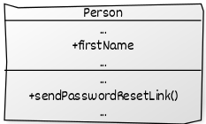
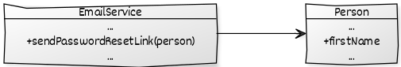
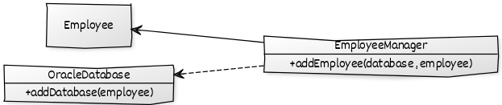
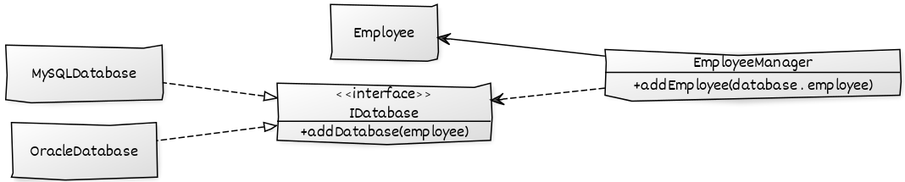

# yazilim-tasarim-desenleri-turkce-kaynak

## OOP

### Nedir?

Nesne yönelimli programlama paradigması, gerçek hayatta olan varlıkları yazılım dünyasında modellemekte kullandığımız, her işlevin nesneler olarak soyutlandığı bir programlama yaklaşımıdır. Tıpkı gerçek hayatta olduğu gibi yazılımda da bu sayede nesnelerimizin öznitelikleri, davranışları olacaktır.
Ortaya çıkış nedenlerinden bazıları da yazılımda; karmaşıklığı azaltmaya, bakım maliyetini düşürmeye, modülariteyi artırmaya, nesneler arası hiyerarşiyi kurmaya yaramasıdır.

## Nesne

### Nedir?


Yukarıda Developer adında bir sınıf görülmektedir. Sınıf alanlar (fields) ve davranışlarımızın (methods) tanımlandığı yerdir. Nesne ise bu sınıftan bir örnek alınmış halidir.

### Nesne Yönelimli Programlama İlkeleri

Nesne yönelimli programlama 4 temel ilke üzerine kuruludur ve bir dilin, nesne yönelimli programlamayı uyguluyor denebilmesi için 4 koşulu da sağlıyor olması gerekiyor. Bunlar; Encapsulation, Abstraction, Inheritance, Polymorphism


## Sınıf

### Nedir?

Yukarıdaki örnekte bir adet sınıf kullanıldı ama gerçek uygulamalarda bildiğimiz gibi bir sınıftan daha fazlası mevcut. Bunlar arasında bir hiyerarşi, düzen mevcut. Tıpkı gerçek hayatta olduğu gibi.
Hiyerarşi düzeninde; genel, kapsayıcı sınıfa superclass (üst sınıf). Bunlardan türeyen sınıflara da subclasses (alt sınıflar) denir. Bu hiyerarşi ile birlikte alt sınıflar, üst sınıfların özelliklerini ve davranışlarını almaktadır.

Örnek Kod C#

```cs
using System;

class Ogrenci
{
public string Adi;
public int Yas;

    public void BilgileriGoster()
    {
        Console.WriteLine("Adı: " + Adi);
        Console.WriteLine("Yaşı: " + Yas);
    }

}

class Program
{
static void Main()
{
Ogrenci ogrenci = new Ogrenci();
ogrenci.Adi = "Ahmet";
ogrenci.Yas = 20;

        ogrenci.BilgileriGoster();

        Console.ReadLine();
    }

}
```

Örnek Kod Java

```java
class Ogrenci {
    String adi;
    int yas;

    void bilgileriGoster() {
        System.out.println("Adı: " + adi);
        System.out.println("Yaşı: " + yas);
    }
}

public class Main {
    public static void main(String[] args) {
        Ogrenci ogrenci = new Ogrenci();
        ogrenci.adi = "Ahmet";
        ogrenci.yas = 20;

        ogrenci.bilgileriGoster();
    }
}

```

Örnek Kod Python

```python
class Ogrenci:
    def __init__(self, adi, yas):
        self.adi = adi
        self.yas = yas

    def bilgileri_goster(self):
        print("Adı:", self.adi)
        print("Yaşı:", self.yas)

ogrenci = Ogrenci("Ahmet", 20)
ogrenci.bilgileri_goster()

```

Bu örneklerde, "Ogrenci" adında bir sınıf oluşturuldu. Bu sınıf içinde "Adi" ve "Yas" adında iki özellik (property) bulunuyor. C# ve Java örneklerinde bu özelliklere doğrudan erişim sağlanabiliyor. Python örneğinde ise "init" metodunu kullanarak sınıfın yapıcı metodunu tanımlayıp, özelliklere erişim sağlanıyor. Ayrıca, her üç dilde de "bilgileriGoster" veya "bilgileri_goster" adında bir metod ile sınıfın özelliklerini ekrana yazdırmak için bir fonksiyon oluşturuldu.

## Encapsulation (Kapsülleme)

### Nedir?

Gereksiz detayların kullanıcıdan gizlenmesidir.

Herhangi bir nesnenin metotlarını, verilerini veya değişkenlerini diğer nesnelerden saklayarak ve bunlara erişimini sınırlandırarak yanlış kullanımlardan koruyan bir konsepttir. Bir nesne üzerinde hem veri soyutlama hem de kontrol soyutlaması yapılıyor ise buna sarma adı verilir. Çoğu programlama dilleri kapsüllemeyi aşağıda sıraladığımız erişim belirteçleri ile desteklerler.

public: Erişimin her yerden yapılabileceği anlamı taşıyor.

private: Erişimin tanımlandığı sınıf içerisinden yapılabileceği anlamı taşıyor.

protected: Sadece tanımlandığı sınıfın içinden veya o sınıftan türetilmiş diğer sınıfların içinden erişilebilir.

Örnek Kod C#

```cs
using System;

class Kisi
{
    private string ad;
    private int yas;

    public void SetAd(string yeniAd)
    {
        ad = yeniAd;
    }

    public string GetAd()
    {
        return ad;
    }

    public void SetYas(int yeniYas)
    {
        if (yeniYas >= 0)
        {
            yas = yeniYas;
        }
        else
        {
            Console.WriteLine("Hatalı yaş değeri.");
        }
    }

    public int GetYas()
    {
        return yas;
    }
}

class Program
{
    static void Main(string[] args)
    {
        Kisi kisi = new Kisi();
        kisi.SetAd("Ahmet");
        kisi.SetYas(30);

        Console.WriteLine("Ad: " + kisi.GetAd());
        Console.WriteLine("Yaş: " + kisi.GetYas());
    }
}

```

Örnek Kod Java

```java
public class Kisi {
    private String ad;
    private int yas;

    public void setAd(String yeniAd) {
        ad = yeniAd;
    }

    public String getAd() {
        return ad;
    }

    public void setYas(int yeniYas) {
        if (yeniYas >= 0) {
            yas = yeniYas;
        } else {
            System.out.println("Hatalı yaş değeri.");
        }
    }

    public int getYas() {
        return yas;
    }
}

public class Main {
    public static void main(String[] args) {
        Kisi kisi = new Kisi();
        kisi.setAd("Ayşe");
        kisi.setYas(25);

        System.out.println("Ad: " + kisi.getAd());
        System.out.println("Yaş: " + kisi.getYas());
    }
}

```

Örnek Kod Python

```python
class Kisi:
    def __init__(self):
        self.__ad = ""
        self.__yas = 0

    def set_ad(self, yeni_ad):
        self.__ad = yeni_ad

    def get_ad(self):
        return self.__ad

    def set_yas(self, yeni_yas):
        if yeni_yas >= 0:
            self.__yas = yeni_yas
        else:
            print("Hatalı yaş değeri.")

    def get_yas(self):
        return self.__yas

kisi = Kisi()
kisi.set_ad("Mehmet")
kisi.set_yas(35)

print("Ad: " + kisi.get_ad())
print("Yaş: " + str(kisi.get_yas()))

```

Bu örneklerde, Kisi sınıfı içinde ad ve yas adında private (private C#, Java; private ve başına çift alt çizgi eklenerek private yapılır - Python) değişkenler kullanılarak encapsulation uygulanmıştır. Bu değişkenlere erişim için set ve get metotları kullanılmıştır. Bu şekilde, değişkenlere doğrudan erişim yerine metodlar aracılığıyla erişim sağlanmış olur ve veri gizliliği ve güvenliği artırılmış olur.

## Inheritance (Kalıtım)

### Nedir?

Bir sınıftan başka sınıfların türetilmesidir.

Kalıtım, mevcut sınıfların üzerine yeni sınıflar oluşturma yeteneğidir. Bu sayede türetilen sınıf, türediği sınıfın özelliklerini devralır. Kalıtımın en büyük yararı kodun yeniden kullanılmasıdır. Mevcut sınıftan biraz farklı bir sınıf oluşturmak istiyorsak, kodu kopyalamamıza gerek yoktur. Bunun yerine, varolan sınıfı genişletir ve ekstra işlevselliği alt sınıfa koyarız.  


Çoğu programlama dilinde yalnızca bir sınıftan türetme işlemi gerçekleştirilmektedir ama birden fazla interface'den (ara birimden) türetilme işlemi de gerçekleştirilebilmektedir.

Örnek Kod C#

```cs
using System;

class Person
{
    protected string ad;
    protected int yas;

    public void BilgileriGoster()
    {
        Console.WriteLine("Ad: " + ad);
        Console.WriteLine("Yaş: " + yas);
    }
}

class Ogrenci : Person
{
    private int ogrenciNo;

    public Ogrenci(string ad, int yas, int ogrenciNo)
    {
        this.ad = ad;
        this.yas = yas;
        this.ogrenciNo = ogrenciNo;
    }

    public void OgrenciBilgileriGoster()
    {
        BilgileriGoster();
        Console.WriteLine("Öğrenci No: " + ogrenciNo);
    }
}

class Program
{
    static void Main(string[] args)
    {
        Ogrenci ogrenci = new Ogrenci("Ayşe", 20, 12345);
        ogrenci.OgrenciBilgileriGoster();
    }
}

```

Örnek Kod Java

```java
class Person {
    protected String ad;
    protected int yas;

    public void bilgileriGoster() {
        System.out.println("Ad: " + ad);
        System.out.println("Yaş: " + yas);
    }
}

class Ogrenci extends Person {
    private int ogrenciNo;

    public Ogrenci(String ad, int yas, int ogrenciNo) {
        this.ad = ad;
        this.yas = yas;
        this.ogrenciNo = ogrenciNo;
    }

    public void ogrenciBilgileriGoster() {
        bilgileriGoster();
        System.out.println("Öğrenci No: " + ogrenciNo);
    }
}

public class Main {
    public static void main(String[] args) {
        Ogrenci ogrenci = new Ogrenci("Mehmet", 22, 67890);
        ogrenci.ogrenciBilgileriGoster();
    }
}

```

Örnek Kod Python

```python
class Person:
    def __init__(self, ad, yas):
        self.ad = ad
        self.yas = yas

    def bilgileri_goster(self):
        print("Ad:", self.ad)
        print("Yaş:", self.yas)

class Ogrenci(Person):
    def __init__(self, ad, yas, ogrenci_no):
        super().__init__(ad, yas)
        self.ogrenci_no = ogrenci_no

    def ogrenci_bilgileri_goster(self):
        self.bilgileri_goster()
        print("Öğrenci No:", self.ogrenci_no)

ogrenci = Ogrenci("Ali", 21, 54321)
ogrenci.ogrenci_bilgileri_goster()

```

Bu örneklerde, Person sınıfı bir kişinin adını ve yaşını temsil ederken, Ogrenci sınıfı Person sınıfından kalıtım alarak öğrenci numarasını ekler. Böylece Ogrenci sınıfı, Person sınıfının özelliklerini ve metotlarını miras alır ve aynı zamanda kendi özel özelliklerini (öğrenci numarası) ve metotlarını da ekleyebilir. Bu, kalıtımın temel mantığıdır.

## Polymorphism (Çok biçimlilik)

### Nedir?

- Nesnelerin türüne bakılmaksızın koşturulmasıdır.
- Robot koş, kuş koş, at koş gibi

Bir nesnenin başka bir nesne gibi davranabilmesi, kullanılabilmesi. Biraz daha açık bir ifade ile: alt sınıfların, üst sınıflara ait olan davranışlarını başka bir biçimde gerçekleştiriyor olması olayıdır.


Nesnenin davranışı çalışma anında belirlendiği için, çok biçimlilik özelliği sayesinde nesnelerin türünü önceden bilmek zorunda kalmayız.

Örnek Kod C#

```cs
using System;

class Sekil
{
    public virtual void Ciz()
    {
        Console.WriteLine("Bir şekil çizildi.");
    }
}

class Dikdortgen : Sekil
{
    public override void Ciz()
    {
        Console.WriteLine("Dikdörtgen çizildi.");
    }
}

class Ucgen : Sekil
{
    public override void Ciz()
    {
        Console.WriteLine("Üçgen çizildi.");
    }
}

class Program
{
    static void Main(string[] args)
    {
        Sekil sekil = new Sekil();
        sekil.Ciz();

        Sekil dikdortgen = new Dikdortgen();
        dikdortgen.Ciz();

        Sekil ucgen = new Ucgen();
        ucgen.Ciz();
    }
}

```

Örnek Kod Java

```java
class Sekil {
    public void ciz() {
        System.out.println("Bir şekil çizildi.");
    }
}

class Dikdortgen extends Sekil {
    public void ciz() {
        System.out.println("Dikdörtgen çizildi.");
    }
}

class Ucgen extends Sekil {
    public void ciz() {
        System.out.println("Üçgen çizildi.");
    }
}

public class Main {
    public static void main(String[] args) {
        Sekil sekil = new Sekil();
        sekil.ciz();

        Sekil dikdortgen = new Dikdortgen();
        dikdortgen.ciz();

        Sekil ucgen = new Ucgen();
        ucgen.ciz();
    }
}

```

Örnek Kod Python

```python
class Sekil:
    def ciz(self):
        print("Bir şekil çizildi.")

class Dikdortgen(Sekil):
    def ciz(self):
        print("Dikdörtgen çizildi.")

class Ucgen(Sekil):
    def ciz(self):
        print("Üçgen çizildi.")

sekil = Sekil()
sekil.ciz()

dikdortgen = Dikdortgen()
dikdortgen.ciz()

ucgen = Ucgen()
ucgen.ciz()

```

Bu örneklerde, Sekil sınıfı bir şekli temsil ederken, Dikdortgen ve Ucgen sınıfları Sekil sınıfından kalıtım alarak kendi ciz metotlarını (metod override) uygularlar. Bu durumda, Sekil türündeki bir nesneyle Dikdortgen veya Ucgen nesnesi aynı metodu çağırabilir ve farklı davranışlar sergileyebilir. Bu, polimorfizmin temel özelliğidir.

## Abstraction (Soyutlama)

### Nedir?

- Ortak özellikteki nesnelerin aynı çatıda toplanmasıdır.
- **Interface** ve **abstract class**'lar aracılığıyla sağlanır.

Farklı kod parçalarının kompleks kısımlarını, sahip oldukları ortak davranışlar, amaçlar, karakteristik özellikler arkasında saklamak sayesinde daha anlaşılır ve kolay kullanılabilir kod yazmaktır abstraction.
Örnek Kod C#

```cs
using System;

abstract class Sekil
{
    public abstract void Ciz();
}

class Dikdortgen : Sekil
{
    public override void Ciz()
    {
        Console.WriteLine("Dikdörtgen çizildi.");
    }
}

class Ucgen : Sekil
{
    public override void Ciz()
    {
        Console.WriteLine("Üçgen çizildi.");
    }
}

class Program
{
    static void Main(string[] args)
    {
        Sekil dikdortgen = new Dikdortgen();
        dikdortgen.Ciz();

        Sekil ucgen = new Ucgen();
        ucgen.Ciz();
    }
}

```

Örnek Kod Java

```java
abstract class Sekil {
    public abstract void ciz();
}

class Dikdortgen extends Sekil {
    public void ciz() {
        System.out.println("Dikdörtgen çizildi.");
    }
}

class Ucgen extends Sekil {
    public void ciz() {
        System.out.println("Üçgen çizildi.");
    }
}

public class Main {
    public static void main(String[] args) {
        Sekil dikdortgen = new Dikdortgen();
        dikdortgen.ciz();

        Sekil ucgen = new Ucgen();
        ucgen.ciz();
    }
}

```

Örnek Kod Python

```python
from abc import ABC, abstractmethod

class Sekil(ABC):
    @abstractmethod
    def ciz(self):
        pass

class Dikdortgen(Sekil):
    def ciz(self):
        print("Dikdörtgen çizildi.")

class Ucgen(Sekil):
    def ciz(self):
        print("Üçgen çizildi.")

dikdortgen = Dikdortgen()
dikdortgen.ciz()

ucgen = Ucgen()
ucgen.ciz()

```

Bu örneklerde, Sekil soyut sınıf (abstract class) olarak tanımlanmıştır. Soyut sınıflar soyut metotlar (abstract methods) içerebilir. Soyut metotlar sadece imza (signature) olarak tanımlanır, yani metotun gövdesi soyut sınıf içinde yer almaz. Soyut metotları olan bir sınıf, bu metotları miras alan alt sınıflar tarafından zorunlu olarak implemente edilmelidir. Bu, soyutlamayı (abstraction) sağlayan bir özelliktir.

## UML(Unified Modeling Language) nedir?

UML, bir sistemin tasarımını görselleştirmek için yazılım mühendisliği alanında genel amaçlı modelleme dilidir. Yazılı bir dil değildir. Farklı amaçlar için kategorilere ayrılmış olsa da, genel itibariyle modelleme için kullanılır. 1995 yılında, yazılımlarda bir standart yaklaşım oluşturmak için geliştirilmiştir. Yani UML diyagramları ile önceden modellediğiniz bir yazılım projesini, modele uygun olacak şekilde herhangi bir dil ile geliştirebiliyorsunuz. Bu da yazılım mühendisleri arasında ortak bir dil oluşturuyor. İlk çıktığı zamandan beri sürekli geliştirme göstererek, birçok farklı dala ayrılmıştır. Aşağıda UML diyagramlarının kategorilerini görebiliyoruz.


Yazılım yaşam döngüsünün **Analiz-Tasarım** aşamalarında oluşturulur.
Analiz → Kullanım senaryosu
Tasarım → Sınıf diyagramı
Programlama dili değildir. Diyagram çizme ve ilişkisel modelleme dilidir


#### 4+1 Bakış Açısı: Farklı aşamalarda farklı UML diyagramları.

1. Kullanıcı Bakışı (User View) → Use - Case
2. Yapısal Bakış (Structural View) → Class
3. Davranış Bakışı (Behavioral View)
4. Gerçekleme Bakışı (Implementation View)
5. Ortam Bakışı (Environment View)

#### UML Modelleri 3 tip sınıf kategorisinde sınıflandırılabilir:

1. Dinamik Davranışsal (Behavioural) Modelleme

- Sequence (Etkileşim)
  Yazılım Tasarımı ve Mimarisi 13
- Communication (İletişim)
- State (Durum)
- Activity (Faaliyet)
- Timing (Zamanlama)

2. Statik Yapısal (Structural) Modelleme

- Class (Sınıf)
- Object (Nesne)
- Deployment (Dağıtım)
- Composite Structure (Bileşke Yapı)
- Component (Bileşen)

3. İşlevsel (Functional) Modelleme

- Use-Case (Kullanım Senaryosu)

## Use-Case Diyagramları

- daha çok analiz aşamasında aktivite diyagramlarıyla birlikte kullanılır.
- Sistemde yapılması gereken işler nelerdir?
- Use case ile aktör arası ilişki: **association**
  Düz çizgi ile ifade edilir.
- Use case'ler arası ilişki: **dependency**
  Kesik çizgi ile ifade edilir.


### Use-case'ler arası ilişkiler:

1. Ürün eklenmesi <<uses>> Ürün varlığı kontrolü
2. Kullanılmayan ürünlerin silinmesi <<extend>> Ürün silinmesi
3. Ödeme <<include>> Kimlik sınama


## Sınıf-Nesne Diyagramları

OOP için geliştirilmiştir.

Class diyagramları, OOP(Nesne Tabanlı Programlama) temel alınarak tasarlanmıştır. Amaç yazılımımız içindeki sınıflar ve aralarındaki ilişkileri tanımlamaktır.

Örnek Kod Java

```java
class Animal {
     private String name;
     private int id;
     private int age;
     public void setName(String name){
         this.name=name;
     }
     public void eat() {
         System.out.println("Eating");
     }
}
```

Animal sınıfını Java’da bu şekilde yazdık. Peki biz bu sınıfı tüm diğer nesne tabanlı dillerde yazabilecek şekilde ifade etmek isteseydik? Yani diğer yazılımcıların da anlayacağı bir dilde yazsaydık. İşte o zaman sınıf diyagramında ifade etmemiz gerekirdi.


- Üstte “Attributes” yani sınıfa ait nitelikler(örneğin isim, yaz, id bilgisi),
- Alt kısımda sınıfa ait metodlar bulunuyor.
- İfadelerin solunda bulunan “-” işareti ise access modifier(erişim niteleyicisi). Yani o niteliğin default, public, private ya da protected olduğunu gösteriyor.
- Sınıf abstract olsaydı Animal yerine Animal şeklinde italik yazarak ifade edebilirdik ya da <<abstract>> şeklinde altına yazabilirdik.
- Aynı şekilde bir interface içinse <<interface>> şeklinde belirtiriz.

## Access modifiers

Public → +
Private → -
Protected → #
package/default -> ~

Sınıf gösterimini gördük. Ancak sınıfın tek başına gösterimi bir şey ifade etmiyor. Bu sınıflar arasındaki bağlantıların gösterimi de önemli.

### UML’de ilişkilerin listesi şu şekilde:

1- Generalization/Inheritance

2- Realization/Implementation

3- Association

4- Dependency (Aggregation & Composition)

#### 1- Generalization/Inheritance


Üstte kalıtımın nasıl ifade edildiğinin gösterimi bulunmakta. Bu gösterim abstract sınıftan kalıtım alırken de aynı. Bu tür kalıtım ilişkisinde **nesneler arasında “IS-A” ilişkisi** bulunmaktadır.

```
“Tortoise IS AN Animal”

“Kaplumbağa bir hayvandır.”
```

#### 2- Realization/Implementation

Bu ilişki **arayüzler ile sınıflar arasındaki ilişki**yi modellemek için kullanılır. Dashed(kesikli) çizgi ile ifade edilir. Kalıtımdaki çizginin kesik kesik olan halidir.


#### 3- Association

Burada da **sınıflar arasında HAS-A ilişkisi** bulunuyor.

##### Associationlar 4 çeşide ayrılmaktadır:

- bi-directional(tek yönlü),
- uni-directional(çift yönlü),
- reflexive
- aggregation & composition

###### Bi-directional Association

Bu iki sınıf arasında tek taraflı bir ilişki olduğunda
kullanılmakta.

Üstteki ilişkinin okunuşu şu şekildedir.

```
“Person HAS AN Address”

“İnsan bir adrese sahiptir”
```

Burada 1 yerine 0..n şeklinde bir ifade de kullanılabilirdi. Üstteki ilişkide 1 yazdığı için, Person sınıfı içerisinde Address sınıfı tipinde bir attribute bulunacağını belirtiyor. Ancak Address sınıfında Person ile ilgili bir bilgi yer almıyor. Çünkü ilişki türü bi-directional(tek yönlü). Ayrıca ilişki ile ilgili aradaki bağlantıya isim verebilmemiz mümkün. Bu tercihe bağlı bırakılmıştır.

###### Uni-directional Association

Bu iki sınıf arasında çift taraflı bir ilişki olduğunda kullanılmakta.


Üstte bunun çok güzel bir örneği bulunmakta. Bu ifadenin Türkçe’si şu şekilde. Student sıfır ya da sonsuz tane kursa kayıt olmuş olabilir, aynı şekilde kursa hiç öğrenci kayıt olmamış olabilir ya da sonsuz tane öğrenci kayıt olabilir. Burada sol tarafta bulunan sınıfı karşı ilişkili olduğu sınıf tarafındaki sayı ilgilendiriyor. Sağdakini de tam tersi. Yani bir kursa en az 1 öğrenci kayıt olmalı ifadesi için Student sınıfı tarafını 1..\* şeklinde değiştirecektik. Student sınıfında Course sınıfından yaratılmış nesnelerin listesi, Course sınıfında da Student sınıfından yaratılmış nesnelerin listesi tutulmakta.

###### Reflexive

Anlaması en zor ilişki bu diyebiliriz. Reflexive(dönüşlü) yani sınıfın kendisi ile yaptığı ilişkidir.


Üstte reflexive ilişki için güzel bir örnek yer alıyor. Directory(Dosya dizini) hiç ya da sonsuz sayıda alt dosya dizinine sahip olabilir. Aynı şekilde hiç ya da 1 tane üst dizine sahip olabilir. Directory sınıfı kendi sınıfından türettiği 2 tane directory nesnesi ile üstteki modeli gerçekleştirebilir.

###### Dependency (Aggregation & Composition)

Bu ilişki türünü çift yönlü association olarak düşünebiliriz. Ancak ekstra sınıflar arasında bağlılıktan söz edeceğiz.

Aggregation ve Composition’da sınıflar arasında parçası olma anlamı vardır. Bir sınıf diğer sınıfın bir parçasıdır. Bu ilişki Aggregation’da biraz daha zayıfken, Composition’da daha güçlüdür. Çünkü Composition ilişkisinde parçası olduğu sınıf yok olursa diğer sınıfta yok olmaktadır. Bu tür ilişkilerde HAS-A ya da IS-PART-OF şeklinde okuyabiliriz.

###### Aggregations (İçerme) İlişkisi

- Sahiptir veya içerir ilişkisini gösterir.
- İçinin boş olması, ilişki olmadan da nesnenin var olabileceğini gösterir.
  

Aşağıda sınıflar arasında Aggregation ilişkisini görebilirsiniz. Tekerlek araba sınıfının bir parçasıdır. Ancak araba sınıfı yok olduğunda tekerlek yok olmak zorunda değildir. Aralarında zayıf bir parça ilişkisi vardır.


###### Composition (Bağımlı İyelik) İlişkisi

- Parçalar olmadan nesne hiçbir anlam ifade etmez.
  

Aşağıda sınıflar arasında Composition ilişkisini görebilirsiniz. Kalp, insan sınıfının bir parçasıdır. İnsan sınıfı yok olduğunda kalpte yok olacaktır. İki sınıf arasında güçlü bir parça ilişkisi vardır. Composition ile agreegation arasındaki fark budur.


### İyi Bir Tasarım

#### 1. Esnemezlik (Rijidite)

- Eğer sistem değişime aşırı derecede direnç gösteriyorsa rijit bir sistemdir.
- İyi bir tasarımda direnç düşük olmalıdır.

#### 2. Kırılganlık (Fragility)

- Daha az kırılgan sistemler geliştirilmelidir.

#### 3. İmmabilite

- Yazılım sistemleri modüler şekilde tasarlanmalıdır.
- Bir projenin modülünün başka bir projede de kullanılmasına **reusability** denir.

## Çevik(Agile) Yazılım Geliştirme Süreci

Agile bir proje yönetim metodolojisi olarak tanımlanabilir. Farklı disiplinlerde farklı framework'ler İle kullanılır.
İlk kullanılmaya başlandığı alan yazılım olduğu İçin yazılım geliştirme metodolojisi olarak da anılmaktadır.

Bu konu ile ilgili sunumu incelemek için [buraya](https://www.canva.com/design/DAFw1kSJ3vk/fTo0fvSROhmkWpz_Gs1cuQ/edit?utm_content=DAFw1kSJ3vk&utm_campaign=designshare&utm_medium=link2&utm_source=sharebutton) tıklayınız.

## Değer Tipi, Referans Tipi, Steak, Heap Nedir/Nasıl Çalışır?

Değer tipi (value type) ve referans tipi (reference type), programlama dillerinde veri türlerini temsil eden iki önemli kavramdır. Bu terimler, bir programın bellek yönetimi ve veri depolama şekli ile ilgilidir. Ayrıca, "stack" ve "heap" terimleri, bellek yönetimiyle ilişkilendirilen iki farklı bellek bölgesini temsil eder.

### Değer Tipi (Value Type)

Değer tipi, değerleri doğrudan içerir ve bellekte değerlerin kendileri saklanır. Değer tipleri, genellikle temel veri tipleri olarak adlandırılır ve bellekte sabit bir boyutta yer kaplarlar. Örnek olarak, **int, float, char** gibi veri tipleri değer tiplerine örnek olarak verilebilir. Değer tipleri doğrudan bellek üzerinde saklandığı için hızlıdır ve bellek yönetimi daha basittir.

```java
int sayi = 42; // Değer tipi örnek: sayi değişkeni değeri doğrudan bellekte saklanır.
```

### Referans Tipi(Reference Type):

Referans tipleri, değerlerin bellekte bir referans aracılığıyla saklandığı nesneleri temsil eder. Yani, bellekte değerlerin kendisi değil, değerlerin bulunduğu bellek adresi (referans) saklanır. Referans tipleri, genellikle **sınıflar, diziler ve diğer nesne tabanlı yapılar** gibi karmaşık veri tipleri olarak kullanılır. Bu tür veri tipleri, bellek yönetimi için daha fazla karmaşıklık gerektirir, çünkü nesneler dinamik olarak bellekte oluşturulabilir ve yönetilebilir.

```java
List<int> sayiListesi = new List<int>(); // Referans tipi örnek: sayiListesi bir referansı saklar ve bellekte dinamik olarak oluşturulur.

```

### Stack:

Stack bellek bölgesi, genellikle değer tipleri ve referanslar için kullanılan bir bellek bölgesidir. **Değer tipleri doğrudan stack bellek bölgesinde saklanır.** Ayrıca, referanslar (nesnelerin bellek adresleri) de stack bellek bölgesinde saklanabilir. Stack bellek bölgesi hızlı erişime izin verir ve bellek yönetimi otomatik olarak gerçekleşir. Ancak, stack bellek bölgesi sabit bir boyuta sahiptir ve genellikle kısıtlı bir büyüklüğe sahiptir.

### Heap:

Heap bellek bölgesi, genellikle **referans tipleri için dinamik bellek tahsisi için kullanılır.** Yani, heap bellek bölgesi, program çalıştığı sürece değişebilen dinamik veri yapılarını (örneğin, değişken boyutlu diziler ve nesneler) saklamak için kullanılır. Heap bellek bölgesi, programcının manuel olarak bellek tahsisi ve geri verme işlemlerinden sorumlu olduğu daha esnek bir bellek alanıdır. Bu, daha fazla bellek kullanım esnekliği sağlar, ancak doğru yönetilmezse bellek sızıntılarına (memory leaks) yol açabilir.


int, short, long, byte, float, double, decimal, char, bool => değer tipi
string, diziler, class, interface, enum, struct => referans tipi

###### null referans tip midir?

Evet, "null" bir referans değeridir.

```
null -> object => referans tip
```

Programlamada, "null" terimi, bir değişkenin değerinin atanmamış veya geçersiz olduğunu ifade eder. Yani, bir değişkenin "null" değeri, bellekte hiçbir nesneyi veya veriyi temsil etmediğini gösterir.

## S.O.L.I.D.

### Nedir?

S.O.L.I.D., yazılım geliştirirken sürdürülebilir kod yazmamızı sağlayan bir prensipler bütünüdür.

Buradaki sürdürülebilirlikten kasıt; yazılım gereksinimleri değiştiğinde ya da mevcut yazılıma eklemeler yapıldığında sistemin buna direnç göstermemesi, en azından en az direnci göstermesi, yani esnek olmasıdır. Bunların yanı sıra bakımının ve anlaşılmasının kolay olması gibi nedenler de sayılabilir.

Bunları yapmamızı sağlayan prensipleri 5 madde içerisinde inceleyeceğiz.

**S → SRP (Single Responsibility Principle)(Tek Sorumluluk Prensibi)**
Her birimin tek bir sorumluluğu olmalıdır.
**O → OCP (Open Closed Principle)(Açık Kapalı Prensibi)**
Geliştirilmeye açık, değişikliğe kapalı olmalıdır.
**L → LSP (Liskov's Substition Principle)(Likov'un Yerine Geçme Prensibi)**
Alt sınıf, üst sınıfın yerine geçtiğinde aynı davranışı göstermelidir.
**I → ISP (Interface Segregation Principle)(Arayüz Ayrımı Prensibi)**
Belirli işlemleri yapan interface'ler oluşturulmalıdır.
**D → DIP (Dependency Inversion Principle)(Bağımlılıkların Tersine Çevrilmesi Prensibi)**
Bağımlılıklar soyut sınıflara doğru olmalıdır

Bu prensipleri daha detaylı inceleyelim:

#### S → SRP (Single Responsibility Principle)(Tek Sorumluluk Prensibi)

Her sınıf, metot, fonksiyon tek bir sorumluluğa sahip olmalıdır.

Şayet bu kurala uymazsak ilerleyen süreçte bir değişikliğe gidildiğinde bunun etkisini birçok yerde görmüş oluruz. Nedeni ise bir yapıya birden fazla sorumluluk yüklenmesinden dolayıdır. Eğer değişikliklerden etkilenen yerler arasında sistemin birçok yerinde kullanılan bir yapımız da varsa maliyet gittikçe artacaktır.



```java
public class Person {
    public String firstName;

    public void sendPasswordResetLink() {
        ...
    }
}
```

Yukarıdaki diyagrama ve koda baktığımızda Person sınıfı içerisinde sendPasswordResetLink() diye bir metot bulunmaktadır. Bu sınıfın asıl amacı kişilere ait bilgileri tutmaktır, şifre sıfırlama bağlantısı göndermek değil. Birden fazla sorumluluk yüklendiği için olası bir mail gönderme değişikliğinde bu sınıf da etkilenecektir.

Yukarıdaki UML diyagramını biraz daha düzenlersek aşağıdaki gibi bir yapı elde edilir.



```java
class Person {
     public String firstName;
}

class EmailService {
    public void sendPasswordResetLink(Person person) {
        ...
    }
}
```

#### O → OCP (Open Closed Principle)(Açık Kapalı Prensibi)

Yapılarımız (sınıf, metot, fonksiyon) gelişime açık değişime kapalı olmalıdır.

Yazılımlar için zamanla değişim şüphesiz kaçınılmazdır; değişen iş kuralları, kullanılan harici kütüphaneler gibi başlıca nedenler örnek gösterilebilir. Bu prensibin anlatmak istediği şey yeni bir davranış ya da özellik eklemek istediğimiz durumda; yapmak istediğimiz değişikliği mevcut koda dokunmadan, değişimi sadece yeni kodlar üzerinden sağlamaktır.



```java
class Employee {
    ...
}

class EmployeeManager {
    public void addEmployee(Object database, Employee employee) {
        if (database instanceof OracleDatabase) {
            ((OracleDatabase) database).addDatabase(employee);
        }
    }
}

class OracleDatabase {
    public void addDatabase(Employee employee) {
        ...
    }
}
```

Yukarıdaki koda ve diyagrama baktığımız zaman EmployeeManager adında bir sınıfımız mevcut ve gelen Employee sınıfına ait nesneyi veri tabanına kayıt ediyor. Veri tabanına kayıt etmeden önce hangi veri tabanı örneği geldiğini de if-else durumlarında kontrol edip tip dönüşümü sağlamaktadır. Yukarıdaki kod örneği maalesef Open-Closed için uygun değildir. Nedeni ise yeni bir veri tabanı eklenmek istediğinde başka bir if-else durumu açılacaktır, yeni eklenen veri tabanı kontrolü sağlanacaktır ve sürekli mevcut koda bir müdahalede bulunulacaktır. Bunu çözmenin yolu ise genelde soyutlamadan geçmektedir.

Yukarıdaki UML diyagramını biraz daha düzenlersek aşağıdaki gibi bir yapı elde edilir. Yeni bir eklemede mevcut koda dokunmaya gerek kalmıyor bu sayede. Kayıt işlemlerini MySQL üzerinde yapmak istediğimiz zaman MySQLDatabase adında bir sınıf oluşturup IDatabase arayüzünü uygulamamız yeterlidir. 🥰



```java
class Employee {
...
}

interface IDatabase {
    void addDatabase(Employee employee);
}

class EmployeeManager {
    public void addEmployee(IDatabase database, Employee employee) {
        database.addDatabase(employee);
    }
}

class OracleDatabase implements IDatabase {
    @Override
    public void addDatabase(Employee employee) {
       ...
    }
}
```

#### L → LSP (Liskov's Substition Principle)(Likov'un Yerine Geçme Prensibi)

#### I → ISP (Interface Segregation Principle)(Arayüz Ayrımı Prensibi)

#### D → DIP (Dependency Inversion Principle)(Bağımlılıkların Tersine Çevrilmesi Prensibi)

## Kaynakça

[1] - https://github.com/yusufyilmazfr/tasarim-desenleri-turkce-kaynak

[2] - https://tugrulbayrak.medium.com/uml-class-diyagramlari-4c3bb7e9cc4c
